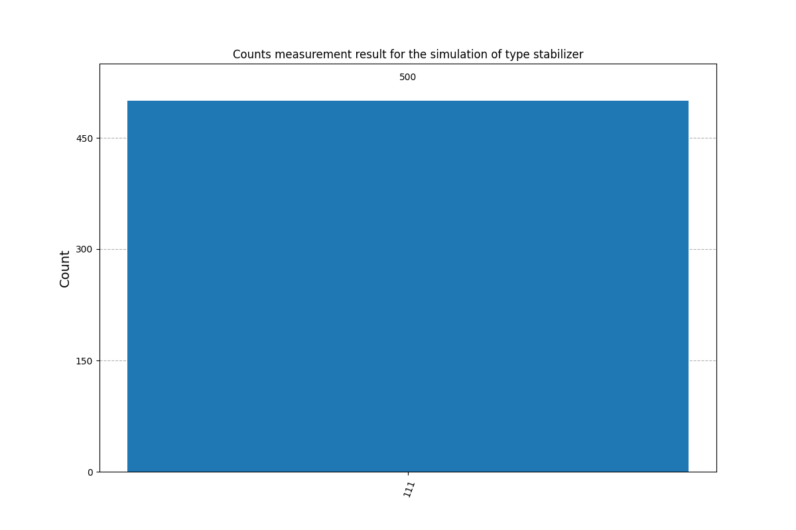
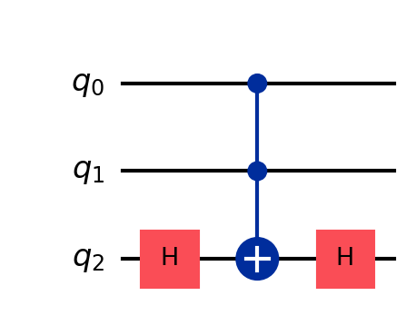
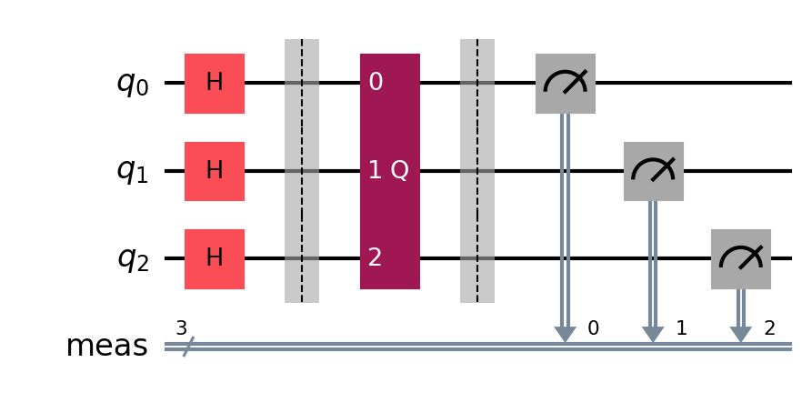
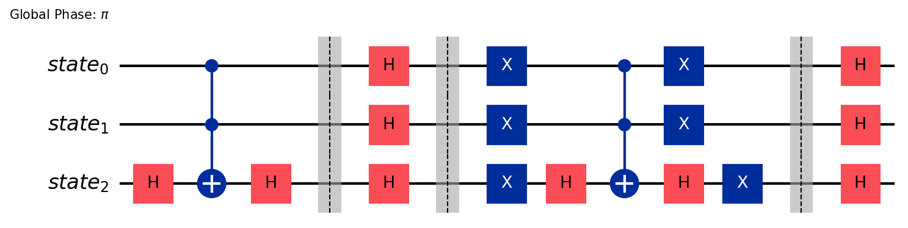
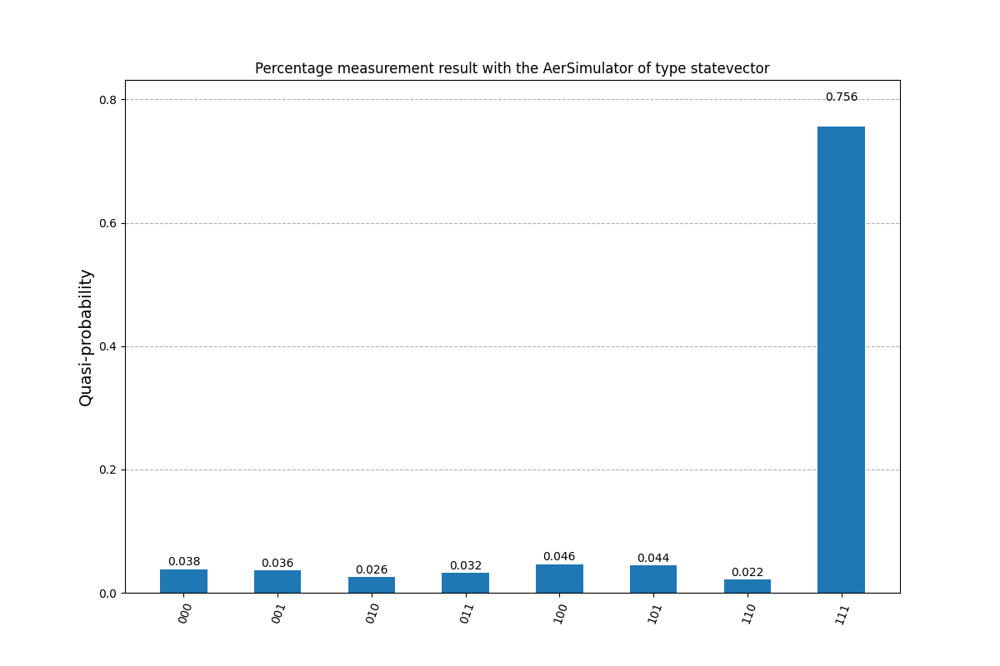

# ftl_quantum

_Pour lire ce readme en [anglais](README.md)_

Le fichier [explications_diverses.md](explications_divers.md) contient un regroupement de documentation sur plusieurs sujets (Qiskit, quantique ...).

Ma version du projet nécessite un fichier `.env`.

Celui-ci contient une variable `TOKEN` dont la valeur est le token API de IMBQ que l'on peut obtenir de https://quantum.ibm.com/

```
TOKEN=ton token ...
```

## Exercice 1: Token

Le sujet pour cet exercice à la consigne suivante:
> En utilisant la fonction IBMQ.get_provider, écrivez un programme qui va devoir:
>
    > - Lister tous les simulateurs quantiques disponibles avec leur queue actuelle.
    > - Lister tous les ordinateurs quantiques disponibles avec leur queue actuelle ainsi que le nombre de qubits qu’ils disposent.

> [!WARNING]
> La fonction `IBMQ.get_provider()` et l’objet `IBMQ` mentionnés sont, depuis la version 0.40.0 du package `qiskit-ibmq-provider` et 0.20.0 de Qiskit obsolète, et ont été supprimés avec la 1.0.0.

J'ai essayé de faire l'exercice avec une ancienne version de Qiskit (0.22.0) mais obtient l'erreur `ImportError: cannot import name 'IBMQ' from partially initialized module 'qiskit'` en voulant importer `IBMQ` de `qiskit`, c.f. la branche dediée: https://github.com/Killian-Morin/ftl_quantum/tree/qiskit_pre_0.40.0

sources annoncant la fin du support `IBMQ.get_provider()`:
- https://github.com/Qiskit/qiskit-ibmq-provider
- https://github.com/Qiskit/qiskit/blob/d86f9958516ee7f48359ddc7364050bb791602d1/releasenotes/notes/1.0/remove-ibmq-4bb57a04991da9af.yaml#L4
- https://medium.com/qiskit/release-news-qiskit-v0-40-is-here-cdcdc8d400d4
- https://docs.quantum.ibm.com/api/migration-guides/qiskit-runtime-from-ibmq-provider → guide de migration pour remplacer `IBMQ.get_provider()`
- https://quantumcomputing.stackexchange.com/questions/37042/ibmq-import-error

<details>
  <summary>Sources</summary>

  [IBMBackend | Qiskit Documentation](https://docs.quantum.ibm.com/api/qiskit-ibm-runtime/qiskit_ibm_runtime.IBMBackend)

  [QiskitRuntimeService.backends() | Qiskit Documentation](https://docs.quantum.ibm.com/api/qiskit-ibm-runtime/qiskit_ibm_runtime.QiskitRuntimeService#backends)
</details>

## Exercice 2: Superposition

L'état à obtenir dans cet exercice est l'état $\frac{1}{\sqrt{2}}(\ket{0}+\ket{1})$.

Cet état est l'état $\ket{+}$ (plus) et fait partie des états communs.

Il peut également être noté de la façon suivante: $\frac{1}{\sqrt{2}}\ket{0}+\frac{1}{\sqrt{2}}\ket{1}$.

Cet état est une superposition égale de $\ket{0}$ et $\ket{1}$. Les coefficients $\alpha$ et $\beta$ ont les deux pour valeurs $\frac{1}{\sqrt{2}}$.
Ces coordonnées (x, y, z) sur la [sphère de Bloch](https://fr.wikipedia.org/wiki/Sph%C3%A8re_de_Bloch) sont (1, 0, 0).

## Exercice 3: Entanglement

Cette fois-ci le circuit à construire implique 2 qubits et doit créer l'état suivant: $\frac{1}{\sqrt{2}}(\ket{00}+\ket{11})$.

Le circuit créé, avec une porte d’Hadamard, une CNOT gate et les deux qubits initialisés à $\ket{00}$ permet de créer l’état $\ket{\Phi^+}$ (Phi), un des [états de Bell](https://fr.wikipedia.org/wiki/%C3%89tats_de_Bell).

## Exercice 4: Quantum noise

La création du circuit est la même que pour l’ex03 mais l'exécution du circuit ne se fait plus sur un simulateur quantique.

On va utiliser un véritable ordinateur quantique pour run ce programme.

Le but de cet exercice est de découvrir ce qu'est le **Quantum noise**. C'est du 'bruit' provoqué par un état intermédiaire, en accord avec certains des principes fondamentaux de la mécanique quantique, notamment le [principe d'incertitude](https://fr.wikipedia.org/wiki/Principe_d%27incertitude).

Cela provoque des resultats auxquels on ne s'attend pas parmi les états quantiques possibles (dans l'histogramme pour l'ordinateur quantique, cela correspond aux états `01` et `10` lors de l'exécution avec un hardware quantique).

| Résultats dans un simulateur (ex03) | Résultats avec un ordinateur quantique (ex04) |
| ------------- | ------------- |
|  |  |

> “The main source of failure in a quantum computer is noise, which comes from rogue forms of energy creeping into the quantum computer making the qubits drift away from where they should be and causing errors.” https://www.youtube.com/watch?v=-UlxHPIEVqA&t=1400s

<hr>

Le circuit doit être optimisé pour le backend sur lequel le programme va être run.

Les backends disponibles ne supportent pas forcement les mêmes configurations, certaines portes et le circuit doit ainsi être *transpilé*.
Cela permet aussi d’optimiser le circuit afin de réduire le nombre d’instructions qui seront exécutées sur l’ordinateur quantique.

Le backend possède ainsi une *Instruction Set Architecture* (ISA), un set d’instructions que ce backend peut comprendre et exécuté. Un circuit exécuté sur un backend doit se conformer à l’ISA de ce backend.

<hr>

Ce qui est retourné par `sampler.run()` est un [`RuntimeJobV2`](https://docs.quantum.ibm.com/api/qiskit-ibm-runtime/qiskit_ibm_runtime.RuntimeJobV2). Certaines méthodes intéressantes: `job_id()`, `status()` et `metrics()` (données sur le temps d’exécution, version des dépendances …).

Ce qui est retourné par `job.result()` où `job` est un `RuntimeJobV2` est un tableau de [`PrimitiveResult`](https://docs.quantum.ibm.com/api/qiskit/qiskit.primitives.PrimitiveResult) avec selon l’index le job correspondant qui à été exécuté.
Sera à `[0]` comme on lance qu’un circuit à la fois et vu les programmes que l’on va faire, l’attribut `metadata` sera souvent vide.
Dans `data` on a le circuit classique où les résultats des mesures ont été mises, ce circuit est appelé par défaut `meas` lorsqu’on utilise `measure_all()`. Dans ce `meas` on a un [`BitArray`](https://docs.quantum.ibm.com/api/qiskit/qiskit.primitives.BitArray) dont la méthode `get_counts` permet d’avoir les résultats en un dictionnaire.

<details>
  <summary>Sources</summary>

  [How to sample a Bell State using Qiskit - Qiskit | Youtube](https://www.youtube.com/watch?v=9MOIBcYf9wk)

  [What are ISA circuits? | IBM Quantum Blog](https://www.ibm.com/quantum/blog/isa-circuits)
</details>

## Exercice 5: Deutsch-Jozsa

Dans les schémas d’exemple du [sujet](data/fr.subject.pdf) (page 9):

- les carrés avec le 'X' correspondent à des gates X

- le cercle avec le '+' $\oplus$ et un point sur un autre qubit correspondent aux CNOT gates. Le qubit où le cercle avec le ‘+’ à le rôle de contrôleur et le qubit avec le point est la target de cette gate.

  Dans le circuit d'Oracle Balanced: $q_3$ à une gate CNOT dont la target est $q_0$, une autre pour $q_1$ et la dernière pour $q_2$.

L’oracle *balanced* sortira toujours `111` comme états finaux pour q_0, q_1 et q_2, des CNOT et X gates sont présentes sur les trois qubits d’input.

L’oracle *constant* sortira toujours `000` comme états finaux pour q_0, q_1 et q_2 comme il n’y a pas de gates sur ces qubits d’input.

Dans mon code:
- Les fonctions *balanced* qui sont créées par `create_new_oracle_function()` pourront avoir des états à 0 et d’autres à 1 comme certains des qubits n’auront pas les mêmes portes appliquées, e.g. `010`, `100` … Dès qu’il y aura un `1` pour l’un des états alors la fonction est *balanced*.

<hr>

### Algorithme de Deutsch-Jozsa

Le Problème de Deutsch-Jozsa:
<hr>

On a une boîte noire quantique, appelé *oracle* qui implémente une fonction booléenne $f: \{0,1\}^n → \{0,1\}$, i.e. pour tout input $0$ ou $1$ où $n$ est le nombre de bits dans l'input, le résultat de la fonction sera toujours $0$ ou $1$, les proportions de sorties de ces possibilités est déterminé par le type de la fonction.

La fonction est *constante*, le résultat est $0$ ou $1$ pour toutes les entrées ou *équilibrée*, le résultat est équilibré entre $0$ et $1$ (moitié des cas 0, l’autre moitié 1).

Le but du problème est de déterminer si la fonction est *constante* ou *équilibrée* à l’aide de l’oracle.

La solution déterministe (avec des moyens classiques) à ce problème nécessite de faire $2^{n-1} + 1$ évaluations (tester la moitié des $2^n$ entrées possibles plus une) de la fonction $f$ dans le pire des cas pour trouver la solution.

L’algorithme quantique de Deutsch-Jozsa permet de déterminer le type de la fonction $f$ en une seule évaluation de celle-ci. Le speedup par rapport à la résolution classique est quadratique.

Cet algorithme quantique illustre l’utilisation de quantum parallelism ainsi que l’interférence quantique.

<hr>

Les étapes de l’algorithme, pour correspondre au sujet (4 qubits):

1. Avoir deux registres quantiques (registre composé de plusieurs qubits) initialisé à 0. Le premier est un registre ayant 3 qubit qui sont utilisés pour faire des requêtes à l’oracle (input), le second registre est un registre d’1 qubit qui stocke la réponse de l’oracle (output).

    L’état du premier registre: $\ket{000}$

    L’état du second registre: $\ket{0}$

2. Créer une superposition pour tout les qubits d’input du premier registre en appliquant une porte d’Hadamard à chaque qubit.
    - l’état

        $$
        H^{\otimes3}\ket{000}\ket{0}=\frac{1}{\sqrt{2^3}}\sum_{\substack{i=0}}^{2^3-1}{\ket{i}\ket{0}}
        $$

3. Retourne le deuxième registre et applique la porte d’Hadamard. C’est pour stocker la réponse de l’oracle dans la phase.
    - l’état

        $$
        \frac{1}{\sqrt{2^3}}\sum_{\substack{i=0}}^{2^3-1}{\ket{i}\ket{0}} \rightarrow \frac{1}{\sqrt{2^{3+1}}}\sum_{\substack{i=0}}^{2^3-1}\ket{i}(\ket{0}-\ket{1})
        $$

4. Query l’oracle
    - l’état

        $$
        \frac{1}{\sqrt{2^{3+1}}}\sum_{\substack{i=0}}^{2^3-1}\ket{i}(\ket{0}-\ket{1}) \rightarrow \frac{1}{\sqrt{2^{3+1}}}\sum_{\substack{i=0}}^{2^3-1}(-1)^{f(i)}\ket{i}(\ket{0}-\ket{1})
        $$

5. Applique la porte d’Hadamard sur le premier registre
6. Mesure le premier registre, si c’est ≠ 0 alors la fonction est balanced, sinon la fonction est constante.

Quand la fonction $f$ est constante, les états quantiques avant et après la query à l’oracle sont les mêmes. L’inverse de la porte d’Hadamard est la porte d’Hadamard elle-même. À l’étape 5., on fait l’opération inverse de celle faite à la 2. pour obtenir l’état quantique initial de tout à 0 pour le premier registre.

Quand la fonction $f$ est balanced, l’état quantique après la query à l’oracle est orthogonal à l’état quantique d’avant la query à l’oracle. À l’étape 5., quand on fait l’opération inverse, on devrait se retrouver avec un état quantique qui est orthogoné à l’état quantique initial de tout à 0 du premier registre. On ne devrait jamais obtenir l’état tout à 0.

Si on run l’algo sur un vrai ordinateur et non un simulateur, on va se retrouver avec du bruit. On ne pourra pas obtenir le type d’oracle avec certitude, contrairement à l’exécution sur simulateur.

Quand on lance le programme avec un simulateur, peu importe le nombre de `shots`, on va toujours avoir les mêmes résultats, `000` pour une fonction *constant* et `111` pour une *balanced*.

Avec un hardware, le bruit sa provoquer des états où pour certains résultats on va avoir des mélanges: `010`, `101` …

### Résultats

#### Constant

Les qubits sont à `0` lorsque l'oracle est **constant**.

| Résultats avec un simulateur | Résultats avec un ordinateur quantique |
| ------------- | ------------- |
|  |  |

#### Balanced

Les qubits sont à `1` lorsque l'oracle est **balanced**.

| Résultats avec un simulateur | Résultats avec un ordinateur quantique |
| ------------- | ------------- |
|  |  |


<details>
  <summary>Sources</summary>

  [Algorithme de Deutsch-Jozsa | Wikipedia](https://fr.wikipedia.org/wiki/Algorithme_de_Deutsch-Jozsa)

  [Deutsch-Jozsa Algorithm - Qiskit Community Tutorials | Github](https://github.com/qiskit-community/qiskit-community-tutorials/blob/master/algorithms/deutsch_jozsa.ipynb)

  [Quantum query algorithms, the Deutsch-Jozsa Algorithm | Qiskit Learning](https://learning.quantum.ibm.com/course/fundamentals-of-quantum-algorithms/quantum-query-algorithms#the-deutsch-jozsa-algorithm)

  [QuantumCircuit.compose() | Qiskit Documentation](https://docs.quantum.ibm.com/api/qiskit/qiskit.circuit.QuantumCircuit#qiskit.circuit.QuantumCircuit.compose)

  [The Deutsch-Jozsa Algorithm — Math, Circuits, and Code | Medium](https://medium.com/quantum-untangled/the-deutsch-jozsa-algorithm-math-circuits-and-code-quantum-algorithms-untangled-f3b28be4cfd3)

</details>

## Exercice 6: Algorithme de recherche

De ce que je comprends de ce qui est demandé, cet exercice est une implémentation de l’algorithme de Grover.

> Votre algorithme doit permettre de rechercher un ou plusieurs éléments qui répondent à un critère donné parmi N éléments non classés.
>
> Vous devrez avoir 3 parties distinctes:
> - L’initialisation des états.
> - L’Oracle.
> - Le Diffuser.
>
> Votre algorithme prendra un nombre Y de qubits (minimum 2) et ne devra demander aucune modification pour fonctionner.
>
> Comme pour l’algorithme de Deutsch-Jozsa, plusieurs Oracle seront fournis lors de l’évaluation pour vérifier le bon fonctionnement de votre algorithme.
>

L’algorithme de Grover permet de faire une recherche avec une complexité de $\mathcal{O}\sqrt{N}$.

Big O notation avec la complexité $\mathcal{O}\sqrt{N}$ comprise: https://en.wikipedia.org/wiki/Time_complexity#/media/File:Comparison_computational_complexity.svg

> le calcul peut être réalisé de manière à donner à l'état intéressant une probabilité proche de 1 et le reste une probabilité négligeable, et mesurer ainsi avec certitude le résultat recherché. C'est exactement ce qui va se passer pour l'algorithme de Grover où une phase « d'amplification » cherche à rendre déterministe le résultat recherché. https://fr.wikipedia.org/wiki/Algorithme_de_Grover
>

> In a nutshell, Grover's algorithm applies different powers of and after each execution checks whether a good solution has been found.
https://github.com/Qiskit/qiskit-tutorials/blob/master/tutorials/algorithms/06_grover.ipynb
>

Une autre capacité utile de cet algo est que la structure interne de la liste à chercher n’est pas utilisée, ce qui fait que l’algo est *générique* donc applicable facilement dans des problèmes différents.

### Step 1: Préparation des états

On applique à tous les qubits du circuit une Hadamard Gate pour les placer dans un état de superposition égale.

### Step 2: L’oracle

> La boîte noire est définie mathématiquement par une fonction $fcritere(x)$ qui identifie si un état «$x$» vérifie un certain critère :
$fcritere(x)={1,\;si\;x\;verifie\;le\;critere\brace 0\;sinon}$
Cette boîte noire est bien entendu en mesure d'accepter une *superposition* d'états en entrée, et donc de vérifier le critère simultanément pour tous les états de la superposition. En effet, la boîte noire est elle-même implémentée par un calcul quantique, qui est en mesure d'opérer sur une superposition d'un bout à l'autre d'algorithme qui détermine le critère.
> https://fr.wikipedia.org/wiki/Algorithme_de_Grover#Pr%C3%A9sentation_g%C3%A9n%C3%A9rale_de_l'algorithme

L’oracle est accessible sous la forme d’un opérateur unitaire $U_\omega$ (avec $\omega$ la query a l’oracle qui renvoie $1$, i.e. le résultat à trouver) qui agit comme suit:

$$
U_\omega \ket{x} = {\;\;\;\ket{x} if\; x=\omega\brace -\ket{x}if\;x\ne\omega}
$$

Cet oracle est une matrice diagonale où l’entrée correspondant à l’état marqué aura une phase négative.

Dans le cas d’un système avec 2 qubits et $\omega = 10$:

$$
U_\omega =
\begin{bmatrix}
1 & 0 & 0 & 0\\
0 & 1 & 0 & 0\\
0 & 0 & -1 & 0\\
0 & 0 & 0 & 1
\end{bmatrix}
\begin{aligned}
\\
\leftarrow \omega = \text{10}
\\
\end{aligned}
$$

Avec 3 qubits et $\omega = 101$:

$$
U_\omega =
\begin{bmatrix}
1 & 0 & 0 & 0 & 0 & 0 & 0 & 0 \\
0 & 1 & 0 & 0 & 0 & 0 & 0 & 0 \\
0 & 0 & 1 & 0 & 0 & 0 & 0 & 0 \\
0 & 0 & 0 & 1 & 0 & 0 & 0 & 0 \\
0 & 0 & 0 & 0 & 1 & 0 & 0 & 0 \\
0 & 0 & 0 & 0 & 0 & -1 & 0 & 0 \\
0 & 0 & 0 & 0 & 0 & 0 & 1 & 0 \\
0 & 0 & 0 & 0 & 0 & 0 & 0 & 1 \\
\end{bmatrix}
\begin{aligned}
\\
\\
\\
\\
\leftarrow \omega = \text{101}
\\
\\
\\
\end{aligned}
$$

Le rôle de l’oracle est de marquer la réponse recherchée dans la liste. Comme mentionné plus haut avec la matrice, le marquage de la réponse se fait en la faisant négative.

C’est ensuite utilisé par le diffuser qui va augmenter la probabilité pour cet état précis afin que lors de la mesure, cet état se distingue des autres.

### Step 3: Le diffuser

“L’opérateur de Grover” possède la forme $\hat{G} = (\hat{H} \hat{Z} \hat{H}) \hat{O}$ où

  - $\hat{O}$ est l’oracle, $\hat{H}$ est l’opérateur/transformée d’Hadamard, $\hat{Z}$ est l’opérateur `Zero phase shift` défini comme $\hat{Z} = 2 \ket{0} \bra{0} - \hat{I}$ ($\hat{I}$ étant l’opérateur d’identité)
  - $\hat{H} \hat{Z} \hat{H}$ est l’**opérateur de diffusion de Grover**

C’est cet opérateur qui va inverser les états autour de la moyenne, *le miroir des amplitudes autour de la moyenne des amplitudes*.
Cela permet d'amplifier l'état cible et de diminuer les autres états.

Cette étape peut être répéter $\frac{\pi}{4} \sqrt{N}$ fois pour attendre un resultat optimal. Avec un système avec 3 qubits, il peut y avoir 8 états possibles donc $\frac{\pi}{4}\sqrt{8} \approx 2$.

> Enter the procedure called amplitude amplification, which is how a quantum computer significantly enhances this probability. This procedure stretches out (amplifies) the amplitude of the marked item, which shrinks the other items' amplitude, so that measuring the final state will return the right item with near-certainty.
https://github.com/Qiskit/textbook/blob/main/notebooks/ch-algorithms/grover.ipynb
>

### Résultats

En utilisant l'oracle donné comme exemple dans le sujet:
<div style="text-align: center;">

  

</div>

On obtient le circuit suivant après avoir initialisé les états des 3 qubits du systeme, combiné le circuit de l'oracle avec la phase d'amplification grâce au `GroverOperator` et enfin combiné les deux circuits (l'initialisation et l'oracle + amplification):

<div style="text-align: center;">

  

  La partie au centre, une fois decomposée donne:
  

</div>

L'oracle du sujet marque l'état `111`, d'où les résultats suivants:

| Résultats avec un simulateur | Résultats avec un ordinateur quantique |
| ------------- | ------------- |
|  |  |
|  |  |

Oracle marquant 2 états comme des solutions pour un circuit avec 3 Qubits:
```python
  oracle = QuantumCircuit(3)

  oracle.x(2)

  qc.compose(MCMT(ZGate(), 2, 1), inplace=True)

  oracle.x([0, 1, 2])

  oracle.compose(MCMT(ZGate(), 2, 1), inplace=True)

  oracle.x([0, 1])

  oracle.draw(output="mpl", filename="oracle_two_solution")
```
On peut facilement expérimenter, en se basant sur cet oracle pour observer la relation entre les états qui sont marqués comme des solutions et les gates permettant la création de circuit.

<details>
  <summary>Sources</summary>

  [Algorithme de Grover | Wikipedia](https://fr.wikipedia.org/wiki/Algorithme_de_Grover)

  [L'informatique quantique c'est simple en fait - V2F | Youtube](https://www.youtube.com/watch?v=wfXs7QXy4IU)

  [A Visual Introduction to Grover's Algorithm and Reflections - Gordon Ma | Youtube](https://www.youtube.com/watch?v=c30KrWjHaw4)

  [Grover's Algorithm - Qiskit Textbook | Github](https://github.com/Qiskit/textbook/blob/main/notebooks/ch-algorithms/grover.ipynb)

  [Grover's Algorithm | IBM Quantum Learning](https://learning.quantum.ibm.com/tutorial/grovers-algorithm)

  [GroverOperator | IBM Quantum Documentation](https://docs.quantum.ibm.com/api/qiskit/qiskit.circuit.library.GroverOperator)

  [Grover's Algorithm | Qiskit Community Tutorials github](https://github.com/Qiskit/qiskit-tutorials/blob/master/tutorials/algorithms/06_grover.ipynb) implémentation utilisant la classe `Grover` qui est deprecated donc pas très pertinent

  [Grover's Quantum Search Algorithm, Geometric Visualization, Quantum Circuit Diagram - Elucydia | Youtube](https://www.youtube.com/watch?v=en9qMDo-CDY)
</details>

## Bonus

Après avoir eu un aperçu des algorithmes demandés pour les bonus, j’ai décidé de ne pas les faire tout de suite au vu de mes lacunes en mathématiques (par exemple le produit scalaire dans **Bernstein-Vazirani**, cela n’a pas l’air essentiel pour le code mais je préfère avoir une compréhension générale plus poussée des mathématiques impliqués). Je compte y revenir plus tard une fois que j’aurai obtenu un math qui me satisfait.

En attendant voici les quelques notes et ressources que j'ai récupérés sur ces algorithmes !

- **Bernstein-Vazirani** est l’algorithme le plus simple des trois et sert principalement d'illustration des capacités des ordinateurs quantiques pour résoudre les problèmes d'oracle en une seule requête. Il ne dépend pas de Simon ou de Shor, mais il introduit des concepts comme la superposition, les oracles quantiques, et la mesure, qui sont communs aux trois algorithmes.
- L’algorithme de **Simon**, plus complexe, introduit des concepts comme la recherche de motifs cachés ou de symétries dans les fonctions, ce qui est fondamental pour l'algorithme de Shor. L'algorithme de Simon est souvent considéré comme un précurseur de l'algorithme de Shor, car il illustre le principe de résolution de problèmes en exploitant des structures cachées grâce à des techniques de mesures quantiques spécifiques.
- **Shor** est l'algorithme le plus avancé, et il utilise des idées similaires à celles de Simon (comme la recherche de période), mais il les étend en utilisant la transformée de Fourier quantique (QFT) pour résoudre des problèmes de factorisation. Shor, donc, est inspiré par les techniques de Simon, mais il introduit une technique supplémentaire, la QFT, qui permet la recherche de périodes dans un contexte multiplicatif.

### Bernstein-Vazirani

L’algorithme de **Bernstein-Vazirani** permet de trouver un `masque secret` $s$ en une seule requête quantique, alors que les méthodes classiques nécessiteraient plusieurs queries. Cet algorithme résout un problème de type `oracle`, où une fonction $f(x)$ est définie de telle sorte que $f(x)=s \cdot x$ (produit scalaire modulo 2).

Cette fonction $f$ est une boite noire qui, pour chaque entrée $x$, retourne le produit scalaire modulo 2 entre $x$ et $s$.

C’est une version restreinte de **Deutsch-Jozsa** mais ici on veut trouver le masque $s$. Comme pour **Deutsch-Jozsa**, en utilisant un circuit quantique avec une superposition de tous les états de $x$, il est possible de découvrir $s$ en une seule requête a la fonction oracle la ou avec une implémentation classique il faudrait tester, dans le pire des cas, chaque bit de $s$ individuellement.

<details>
  <summary>Sources</summary>

  [Algorithme de Bernstein-Vazirani | Wikipedia](https://fr.wikipedia.org/wiki/Algorithme_de_Bernstein-Vazirani)

  [Bernstein-Vazirani Algorithm - Qiskit Textbook | Github](https://github.com/Qiskit/textbook/blob/main/notebooks/ch-algorithms/bernstein-vazirani.ipynb)

  [Bernstein-Vazirani Algorithm - Qiskit Community Tutorials | Github](https://github.com/qiskit-community/qiskit-community-tutorials/blob/master/algorithms/bernstein_vazirani.ipynb)

  [The Bernstein-Vazirani Algorithm: Quantum Algorithms Untangled | Medium](https://medium.com/quantum-untangled/the-bernstein-vazirani-algorithm-quantum-algorithms-untangled-67e58d4a5096)

  [Learn Quantum Computing with Qiskit: Bernstein-Vazirani Algorithm | Medium](https://medium.com/@_monitsharma/learn-quantum-computing-with-qiskit-bernstein-vazirani-algorithm-fa1300517624)

  [IQIS Lecture 6.7 — The Bernstein-Vazirani algorithm - Artur Ekert | Youtube](https://www.youtube.com/watch?v=60OHCftlqbA)
</details>

### Simon

L’algorithme de **Simon** résout le `problème de Simon`, qui consiste a trouver un motif cache $s$ pour une fonction $f(x)$ vérifiant $f(x) = f(x \otimes s)$, où $\otimes$ est l’addition modulo 2 (XOR). L’objectif est de découvrir le motif $s$ qui est un vecteur binaire inconnu.

On a encore une fois un oracle quantique évaluant $f(x)$.

Grace a l’intrication et a la mesure quantique, on peut obtenir plusieurs équations linéaires en $s$ (sous forme de vecteurs indépendants).

Après avoir obtenu suffisamment d’équations, on résout le système pour identifier $s$.

Avec une implémentation classique, ce problème nécessite un nombre exponentiel d’évaluations de $f(x)$, tandis que l’algorithme quantique de Simon ne nécessite qu’un nombre polynomial d’étapes.

Cet algorithme est un précurseur a celui de **Shor** car il démontre (entre autre) comment utiliser les propriétés quantiques pour découvrir des structures cachées dans des fonctions.

<details>
  <summary>Sources</summary>

  [Simon's Problem | Wikipedia](https://en.wikipedia.org/wiki/Simon%27s_problem)

  [Simon's Algorithm - Qiskit Textbook | Github](https://github.com/Qiskit/textbook/blob/main/notebooks/ch-algorithms/simon.ipynb)

  [Simon's Algorithm - Qiskit Community Tutorials | Github](https://github.com/qiskit-community/qiskit-community-tutorials/blob/master/algorithms/simon_algorithm.ipynb)

  [Simon’s Algorithm: Quantum Algorithms Untangled | Medium](https://medium.com/quantum-untangled/simons-algorithm-quantum-algorithms-untangled-62c8f81ed27a)

  [IQIS Lecture 6.8 — Simon's algorithm - Artur Ekert | Youtube](https://www.youtube.com/watch?v=sxIdRKTdRRU)
</details>

### Shor

L'algorithme de **Shor** est célèbre pour sa capacité à factoriser de grands nombres entiers en facteurs premiers de manière exponentiellement plus rapide que les algorithmes classiques, résolvant ainsi un problème central de la cryptographie.

La factorisation des nombres est reliée à la recherche de la période d'une fonction exponentielle modulaire, c’est-à-dire le plus petit entier $r$ pour lequel $a^r \equiv 1 \mod N$ où $N$ est le nombre à factoriser et $a$ est un nombre choisi aléatoirement.

En utilisant la transformée de Fourier quantique (Quantum Fourier Transform, QFT), l’algorithme de **Shor** peut détecter cette période efficacement.

Une fois la période $r$ trouvée, des techniques de mathématiques classiques permettent de dériver des facteurs premiers de $N$ avec une probabilité élevée.

Cet algorithme s’appuie sur des concepts similaires a ceux de l’algorithme de **Simon** (recherche de périodes et utilisation d’oracles quantiques).
C’est aussi l’un des plus puissants en cryptographie quantique, car il peut casser les systèmes cryptographiques bases sur la difficulté de factorisation (comme RSA).

<details>
  <summary>Sources</summary>

  [Algorithme de Shor](https://fr.wikipedia.org/wiki/Algorithme_de_Shor)

  [Shor's Algorithm — Programming on Quantum Computers — Coding with Qiskit S2E7 | Youtube](https://www.youtube.com/watch?v=EdJ7RoWcU48)

  [The Story of Shor's Algorithm, Straight From the Source | Peter Shor - Qiskit | Youtube](https://www.youtube.com/watch?v=6qD9XElTpCE)

  [Shor's Algorithm - Qiskit Textbook | Github](https://github.com/Qiskit/textbook/blob/main/notebooks/ch-algorithms/shor.ipynb)

  [Shor's Algorithm - Qiskit Community Tutorials | Github](https://github.com/qiskit-community/qiskit-community-tutorials/blob/master/algorithms/shor_algorithm.ipynb)

  [Shor’s Algorithm Explained & Implemented using IBM Qiskit | Medium](https://medium.com/@chebilmohamedaziz04/shors-algorithm-explained-implemented-using-ibm-qiskit-58ad6ce53c00)

  [Learn Quantum Computing with Qiskit: Shor’s Algorithm | Medium](https://medium.com/@_monitsharma/learn-quantum-computing-with-qiskit-shors-algorithm-971b3f6d8795)

  [Demonstration of Shor’s factoring algorithm for N=21 on IBM quantum processors | Nature](https://www.nature.com/articles/s41598-021-95973-w)

  [IQIS Lecture 6.9 — Shor's algorithm - Artur Ekert | Youtube](https://www.youtube.com/watch?v=TioipZX7d5U)
</details>

## Documentation

### Mentionnées par le sujet

[La lévitation quantique - Julien Bobroff, à l'USI | Youtube](https://www.youtube.com/watch?v=6kg2yV_3B1Q)

[David Louapre Physique Quantique | Youtube](https://www.youtube.com/results?search_query=david+louapre+physique+quantique)

Vidéos interéssantes (There is more to explore here) sur le sujet de [David Louapre - ScienceEtonnante](https://www.youtube.com/@ScienceEtonnante)

  - [La mécanique quantique en 7 idées | Youtube](https://www.youtube.com/watch?v=Rj3jTw2DxXQ&pp=ygUlZGF2aWQgbG91YXByZSBwcm9ncmFtbWF0aW9uIHF1YW50aXF1ZQ==)

  - [La mécanique quantique [Vidéo]](https://scienceetonnante.com/2015/10/02/la-mecanique-quantique-video/)

  - [Les Ordinateurs Quantiques | Youtube](https://www.youtube.com/watch?v=bayTbt_8aNc)

  - [L'intrication quantique | Youtube](https://www.youtube.com/watch?v=5R6k2mEacZo)

  - [Les inégalités de BELL & les expériences d'Alain ASPECT | Youtube](https://www.youtube.com/watch?v=28UN70790Do)

  - [Les inégalités de Bell et les expériences d’Alain Aspect](https://scienceetonnante.com/2020/10/23/bell-aspect/)

  - [Alain Aspect : Intrication quantique et inégalités de Bell [Interview complète] | Youtube](https://www.youtube.com/watch?v=OeZ_63iKPho)

[Une brève histoire du temps: du big bang aux trous noirs - Stephen W. Hawking | Archive.org](https://archive.org/details/unebrevehistoire0000hawk_p0i8)

[L'univers à portée de main - Christophe Galfard | Anna's archive](https://annas-archive.org/md5/841df5dfbae95a35308591344058e517)

### Divers

[L'informatique quantique, c'est simple, en fait. - V2F | Youtube](https://www.youtube.com/watch?v=wfXs7QXy4IU)

[Understanding Superposition Physically and Mathematically in Classical and Quantum Physics](https://www.physicsforums.com/insights/understanding-superposition/)

[LinuxFoundationX: Introduction to Quantum Circuits](https://www.edx.org/learn/quantum-computing/the-linux-foundation-introduction-to-quantum-circuits?webview=false&campaign=Introduction+to+Quantum+Circuits&source=edx&product_category=course&placement_url=https://www.edx.org/school/linuxfoundationx)

[What is Quantum Computing? | IBM](https://www.ibm.com/topics/quantum-computing)

[Quantum Computing Stack Exchange](https://quantumcomputing.stackexchange.com/)

[FLP Vol. III Table of Contents](https://www.feynmanlectures.caltech.edu/III_toc.html)

[Photons Jumeaux | Chaîne Youtube](https://www.youtube.com/@photonsjumeaux4395/videos)

[Qiskit | Slack](https://qiskit.enterprise.slack.com)

[Qiskit | Youtube](https://www.youtube.com/@qiskit)

[IBM Quantum Documentation](https://docs.quantum.ibm.com/)

[Qiskit | IBM Quantum Computing](https://www.ibm.com/quantum/qiskit)

[qiskit | IBM Quantum Documentation](https://docs.quantum.ibm.com/api/qiskit)

[qiskit-community-tutorials | github](https://github.com/qiskit-community/qiskit-community-tutorials)

[Basics of Quantum Information | IBM Quantum Learning](https://learning.quantum.ibm.com/course/basics-of-quantum-information)

[Fundamentals of Quantum Algorithms | IBM Quantum Learning](https://learning.quantum.ibm.com/course/fundamentals-of-quantum-algorithms)

[The Map of Quantum Computing - Quantum Computing Explained](https://www.youtube.com/watch?v=-UlxHPIEVqA) ->  https://www.flickr.com/photos/95869671@N08/51721957923/

[Who Has The Best Quantum Computer? - Domain of Science | Youtube](https://www.youtube.com/watch?v=gcbMKt079l8)

[Quantum Computing - Domain of Science | Youtube](https://www.youtube.com/watch?v=VyX8E4KUkWw)

[Understanding Quantum Mechanics - Sabine Hossenfelder | Youtube Playlist](https://www.youtube.com/playlist?list=PLwgQsqtH9H5djIfFhXE6We207beTgUnyL)

[Introduction to Quantum Computing and Quantum Hardware - Qiskit | Youtube Playlist](https://www.youtube.com/playlist?list=PLOFEBzvs-VvrXTMy5Y2IqmSaUjfnhvBHR)
