# ftl_quantum

_You can read this in [french](README.fr.md)_

My version of the project requires an `.env` file.

It contains a `TOKEN` field, whose value is your IMBQ API token, which you can obtain from https://quantum.ibm.com/

```
TOKEN=Your token ...
```

## Exercice 1: Token

The subject for this exercice asked the following:
> By using the IBMQ.get_provider function, write a program that will have to:
>
    > - List all available quantum simulators with their current queue.
    > - List all available quantum computers with their current queue and the number of qubits they have.

The function `IBMQ.get_provider()` and the object `IBMQ` are deprecated since the version 0.40.0 of the package `qiskit-ibmq-provider` and 0.20.0 of Qiskit. They were deleted with the version 1.0.0 of Qiskit.

I attempted to create an environment with a previous version of Qiskit but I was not able to make it work. See the dedicated branch if you're interested: https://github.com/Killian-Morin/ftl_quantum/tree/qiskit_pre_0.40.0

sources for the deprecation
- https://github.com/Qiskit/qiskit-ibmq-provider
- https://github.com/Qiskit/qiskit/blob/d86f9958516ee7f48359ddc7364050bb791602d1/releasenotes/notes/1.0/remove-ibmq-4bb57a04991da9af.yaml#L4
- https://medium.com/qiskit/release-news-qiskit-v0-40-is-here-cdcdc8d400d4
- https://docs.quantum.ibm.com/api/migration-guides/qiskit-runtime-from-ibmq-provider -> migration guide to replace `IBMQ.get_provider()`
- https://quantumcomputing.stackexchange.com/questions/37042/ibmq-import-error

<details>
  <summary>Sources</summary>

  [IBMBackend - Qiskit Documentation](https://docs.quantum.ibm.com/api/qiskit-ibm-runtime/qiskit_ibm_runtime.IBMBackend)

  [QiskitRuntimeService.backends() - Qiskit Documentation](https://docs.quantum.ibm.com/api/qiskit-ibm-runtime/qiskit_ibm_runtime.QiskitRuntimeService#backends)
</details>

## Exercice 2: Superposition

The state to create in this exercice is the following: $\frac{1}{\sqrt{2}}(\ket{0}+\ket{1})$.

This state is the 'plus' state, $\ket{+}$.

It can also be written as $\frac{1}{\sqrt{2}}\ket{0}+\frac{1}{\sqrt{2}}\ket{1}$.

This state has an equal superposition of $\ket{0}$ and $\ket{1}$. The factors $\alpha$ and $\beta$ each has a value of $\frac{1}{\sqrt{2}}$.
The coordinates for the 'plus' state on the [Bloch Sphere](https://en.wikipedia.org/wiki/Bloch_sphere) are (1, 0, 0).

## Exercice 3: Entanglement

For this exercice the circuit to code require 2 qubits and must create the following state: $\frac{1}{\sqrt{2}}(\ket{00}+\ket{11})$.

This circuit is created with an Hadamard gate, a CNOT gate and the two qubits are set to $\ket{00}$.

The resulting state is the $\ket{\Phi^+}$ (Phi) state, one of the [Bell's state](https://en.wikipedia.org/wiki/Bell_state).

## Exercice 4: Quantum noise

The circuit, and thus the state to create, is the same as for ex03 but the code will be executed on real quantum hardware, not a quantum simulator.

The goal of this exercice is to discover what is **quantum noise**. This 'noise' is a result of intermediary states that appears when evaluating the state of the qubits. This is in accordance with some fundamental principles of quantum mecanic, especially the [uncertainity principle](https://en.wikipedia.org/wiki/Uncertainty_principle).

Those intermediary states leads to unexpected results among the possible quantum states. In the histogram for quantum hardware, the noise corresponds to the states `01` and `10`.

| Results with a simulator (ex03)  |  Results with quantum hardware (ex04) |
| :-------------: | :-------------: |
| 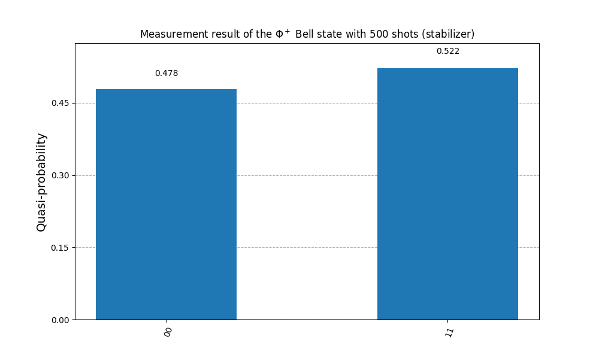 | 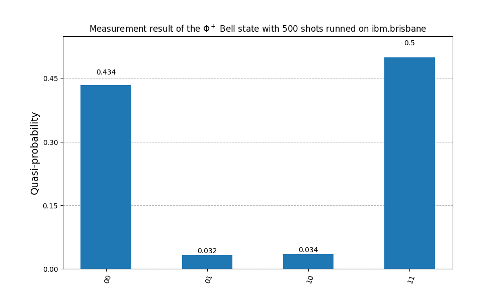 |

> “The main source of failure in a quantum computer is noise, which comes from rogue forms of energy creeping into the quantum computer making the qubits drift away from where they should be and causing errors.” https://www.youtube.com/watch?v=-UlxHPIEVqA&t=1400s

<hr>

The circuit needs to be optimized/adapted to the backend on which it will run.

Each available backends do not have the same configurations, do not support the same gates, thus the circuit needs to be *transpiled* to the backend where it will be run.
This also allow a step to optimize the circuit in order to reduce the total number of instructions that will be made on the quantum computer.

Each backend has an *Instruction Set Architecture* (ISA). This set indicates which instructions this backend can handle. A circuit executed on a backend must comply with the ISA of this backend.

<hr>

The object returned by `sampler.run()` is a [RuntimeJobV2](https://docs.quantum.ibm.com/api/qiskit-ibm-runtime/qiskit_ibm_runtime.RuntimeJobV2). Some useful methods are `job_id()`, `status()` or `metrics()`.

`job.result()` with `job` as a `RuntimeJobV2` instance will give back an array of [`PrimitiveResult`](https://docs.quantum.ibm.com/api/qiskit/qiskit.primitives.PrimitiveResult) with the index being the job corresponding to the entry.
Since we launch the circuit one time, the result will be at `[0]`, the `metadata` attribut will often be empty with the use of Qiskit in this project.
`data` holds the classical circuit where the results are stored, this circuit is named by default `meas` when using `measure_all()` to mesure the result. Inside this `meas` we find a [`BitArray`](https://docs.quantum.ibm.com/api/qiskit/qiskit.primitives.BitArray) whose method `get_counts()` will return the results as a dictionnary.

<details>
  <summary>Sources</summary>

  [How to sample a Bell State using Qiskit - Qiskit Youtube](https://www.youtube.com/watch?v=9MOIBcYf9wk)

  [What are ISA circuits? - IBM Quantum Blog](https://www.ibm.com/quantum/blog/isa-circuits)
</details>

## Exercice 5: Deutsch-Jozsa

In the circuits of the [subject](data/en.subject.pdf) (page 9):

- the squares with the 'X' represents [X gates](https://docs.quantum.ibm.com/api/qiskit/qiskit.circuit.library.XGate)

- the circles with the '+' $\oplus$ and a point on another qubit are the symbol for [CNOT gates](https://en.wikipedia.org/wiki/Controlled_NOT_gate) or [Controlled-X gate](https://docs.quantum.ibm.com/api/qiskit/qiskit.circuit.library.CXGate). The qubit where the circle with the '+' is a controller while the qubit with the point is the target of this gate.

  In the Balanced Oracle circuit: $q_3$ is the controller of 3 CNOT gates where the target are, respectively for each target qubit: $q_0$, $q_1$ and $q_2$.

The *balanced* oracle will always result in the final state `111` for $q_0$, $q_1$ and $q_2$. CNOT and X gates are present on the three qubit of input.

The *constant* oracle will always result with the final state `000` for $q_0$, $q_1$ and $q_2$ since they are no gates on those qubits to change their states.

Some information about my script:
- The *balanced* functions created with `create_new_oracle_function()` will have some states with `0` and `1` mixed since some qubits will not have the same gates. For example, a *balanced* function can result with a final state of `010`, `100` ...
If a `1` is present in the final state, then the function will be *balanced*.

<hr>

### Deutsch-Jozsa Algorithm

The Deutsch-Jozsa problem:
<hr>

We have a quantum black box called *oracle* that implements a boolean function $f: \{0,1\}^n → \{0,1\}$, i.e. for all input $0$ or $1$ where $n$ is the number of bits in the input, the result of the function will always be $0$ or $1$. The propabilites of those outcomes depends on the type of function used as *oracle*.

With a *constant* function the result will be either $0$ or $1$ for each input while a *balanced* function will have a balanced result: one half of $0$ and the other half of $1$.

The aim of this problem is to evaluate if the function is *constant* or *balanced* using the oracle.

The deterministic solution (with a classical computer/conventional means) to this problem requires to do $2^{n-1} + 1$ (try half of the $2^n$ entries plus one) queries to the function $f$ in the worst case scenario.

The quantum algorithm of Deutsch-Jozsa determines the type of $f$ in a _single_ evaluation. The speedup compared to the conventional solution is *quadratric* (squared).

This quantum algorithm is a perfect example of quantum parallelism and [quantum interference](https://en.wikipedia.org/wiki/Wave_interference).

<hr>

The algorithm steps to match the subject with 4 qubits:

1. Have 2 quantum registers (system composed of multiple qubits) sets to 0. The first register has 3 qubits that are used to make queries to the oracle (it's the input), the second register has a single qubit that will store the response of the oracle (output).

    The state of the first register is $\ket{000}$.

    The state of the second register is $\ket{0}$.

2. Create a superposition state of each input qubits of the first register by applying an Hadamard gate on each qubit.
    - the resulting state:
        $$H^{\otimes3}\ket{000}\ket{0}=\frac{1}{\sqrt{2^3}}\sum_{\substack{i=0}}^{2^3-1}{\ket{i}\ket{0}}$$

3. Return the second resigter and apply an Hadamard gate. This is to store the response of the oracle .
    - the resulting state:
        $$\frac{1}{\sqrt{2^3}}\sum_{\substack{i=0}}^{2^3-1}{\ket{i}\ket{0}} \rightarrow \frac{1}{\sqrt{2^{3+1}}}\sum_{\substack{i=0}}^{2^3-1}\ket{i}(\ket{0}-\ket{1})$$

4. Query the oracle
    - the corresponding state:
        $$\frac{1}{\sqrt{2^{3+1}}}\sum_{\substack{i=0}}^{2^3-1}\ket{i}(\ket{0}-\ket{1}) \rightarrow \frac{1}{\sqrt{2^{3+1}}}\sum_{\substack{i=0}}^{2^3-1}(-1)^{f(i)}\ket{i}(\ket{0}-\ket{1})$$

5. Apply an Hadamard gate on the first register
6. Measure the second register, if it's not 0 the function is balanced, else it's constant.

When $f$ is **constant**, the quantum states before and after the query to the oracle are the same. The reverse of the Hadamard gate is the Hadamard gate itself.
The step 5. consists of doing the opposite operation of the one done at step 2. to get back the initial quantum state of all `0` for the first register.

When $f$ is **balanced**, the quantum states after the query to the oracle is _orthogonal_ to the quantum states of before the query.
At step 5. we do the inverse operation of step 2., we would end up with the quantum state orthogonal to the initial quantum state of all `0` of the first register. We would never have a result of all `0`.

If we execute the algorithm on a real computer and not a simulator we would have to account for _noise_. We couldn't get back the oracle type with certainty, unlike with the execution on a simulator.

## Résultats

### Constant

The qubits are at `0` when the Oracle is **constant**.

| Results with a simulator | Results with real quantum hardware |
| :-------------: | :-------------: |
|  | 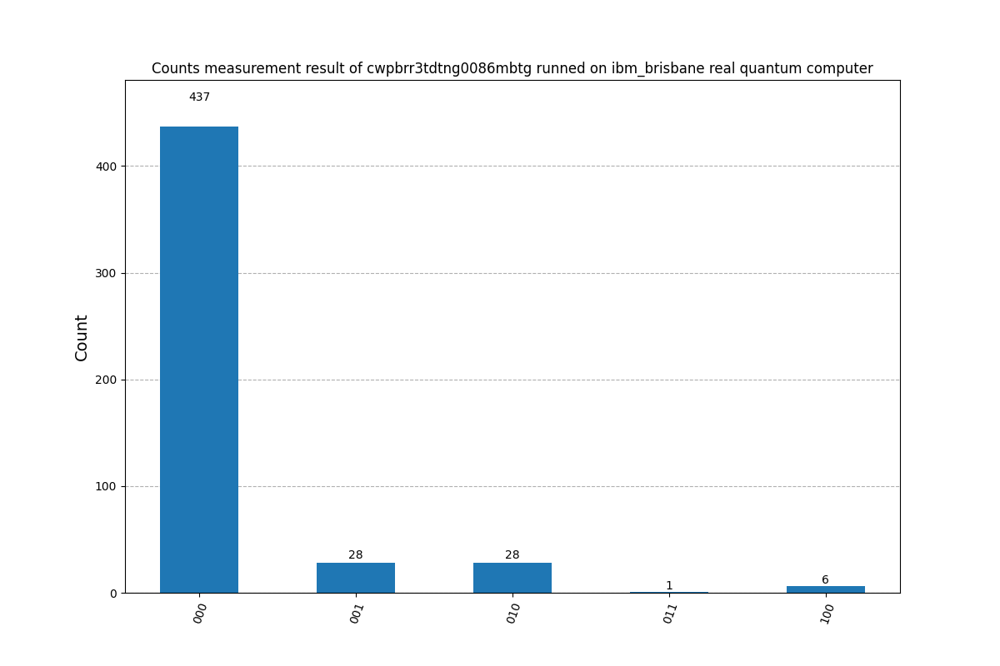 |

### Balanced

The qubits are at `1` when the Oracle is **balanced**.

| Results with a simulator | Results with real quantum hardware |
| :-------------: | :-------------: |
| 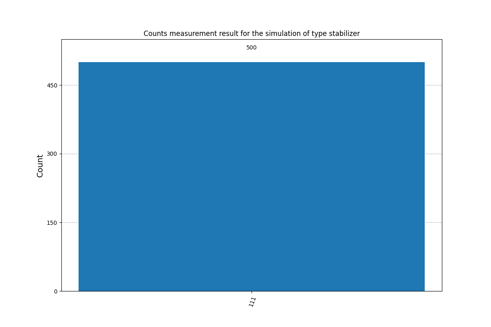 | 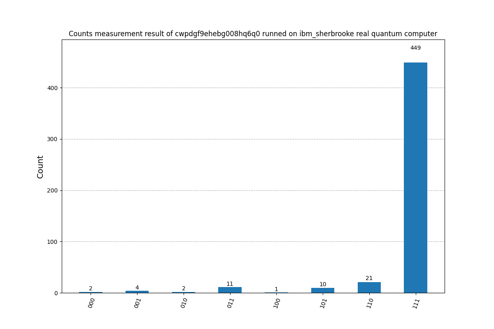 |


<details>
  <summary>Sources</summary>

  [Algorithme de Deutsch-Jozsa - Wikipedia](https://fr.wikipedia.org/wiki/Algorithme_de_Deutsch-Jozsa)

  [Deutsch-Jozsa Algorithm - Qiskit Tutorials](https://github.com/qiskit-community/qiskit-community-tutorials/blob/master/algorithms/deutsch_jozsa.ipynb)

  [Quantum query algorithms, the Deutsch-Jozsa Algorithm - Qiskit Learning](https://learning.quantum.ibm.com/course/fundamentals-of-quantum-algorithms/quantum-query-algorithms#the-deutsch-jozsa-algorithm)

  [QuantumCircuit.compose() - Qiskit Documentation](https://docs.quantum.ibm.com/api/qiskit/qiskit.circuit.QuantumCircuit#qiskit.circuit.QuantumCircuit.compose)

  [The Deutsch-Jozsa Algorithm — Math, Circuits, and Code - Medium](https://medium.com/quantum-untangled/the-deutsch-jozsa-algorithm-math-circuits-and-code-quantum-algorithms-untangled-f3b28be4cfd3)

</details>

## Exercice 6: Search Algorithm

From what I can tell, this exercice is an implementation of the Grover's algorithm.

> Your algorithm should search for one or more items that meet a given requirement among N unclassified items.
>
> You will need to have 3 distinct parts:
> - The initialization of states.
> - The Oracle.
> - Diffuser.
>
> Your algorithm will take a Y number of qubits (minimum 2) and must not require any modification to work.
>
> Similar to the Deutsch-Jozsa algorithm, several Oracle’s will be provided during the evaluation to verify that your algorithm is working properly.

Grover's Algorithm is able to do a search in a system with a time complexity of $\mathcal{O}\sqrt{N}$.

A Big O notation with the $\mathcal{O}\sqrt{N}$ complexity: https://en.wikipedia.org/wiki/Time_complexity#/media/File:Comparison_computational_complexity.svg

> In a nutshell, Grover's algorithm applies different powers of and after each execution checks whether a good solution has been found.
https://github.com/Qiskit/qiskit-tutorials/blob/master/tutorials/algorithms/06_grover.ipynb
>

Since the algorithm does not rely on the internal structure of the list that is passed as input, it can be easily applied to differents problems.

### Step 1: Initialization of states

We apply an Hadamard gate on all qubits of the circuit to put them in equal superposition states.

### Step 2: The Oracle

The oracle can be summarize with a unitary operator $U_\omega$ (with $\omega$ the query to the oracle that returns $1$, i.e. the result to find):

$$
U_\omega \ket{x} = {\;\;\;\ket{x} if\; x=\omega\brace -\ket{x}if\;x\ne\omega}
$$

This oracle will be a diagonal matrix, where the entry that correspond to the marked item will have a negative phase.

With 2 qubits and $\omega = 10$:

$$
U_\omega =
\begin{bmatrix}
1 & 0 & 0 & 0\\
0 & 1 & 0 & 0\\
0 & 0 & -1 & 0\\
0 & 0 & 0 & 1
\end{bmatrix}
\begin{aligned}
\\
\leftarrow \omega = \text{10}
\\
\end{aligned}
$$

With 3 qubits and $\omega = 101$:

$$
U_\omega =
\begin{bmatrix}
1 & 0 & 0 & 0 & 0 & 0 & 0 & 0 \\
0 & 1 & 0 & 0 & 0 & 0 & 0 & 0 \\
0 & 0 & 1 & 0 & 0 & 0 & 0 & 0 \\
0 & 0 & 0 & 1 & 0 & 0 & 0 & 0 \\
0 & 0 & 0 & 0 & 1 & 0 & 0 & 0 \\
0 & 0 & 0 & 0 & 0 & -1 & 0 & 0 \\
0 & 0 & 0 & 0 & 0 & 0 & 1 & 0 \\
0 & 0 & 0 & 0 & 0 & 0 & 0 & 1 \\
\end{bmatrix}
\begin{aligned}
\\
\\
\\
\\
\leftarrow \omega = \text{101}
\\
\\
\\
\end{aligned}
$$

The job of the oracle is to mark the answer in the list. Like in the above matrix, the answer is highlighted by making it negative.

This is then used by the diffuser to augment the probabilities of this state so that when measuring the states it will be distinguable from the others states.

### Step 3: The Diffuser

The Grover Operator has the following form: $\hat{G} = (\hat{H} \hat{Z} \hat{H}) \hat{O}$ where $\hat{O}$ is the oracle, $\hat{H}$ is the Hadamard transform, $\hat{Z}$ is the operator `Zero phase shift` defined as $\hat{Z} = 2 \ket{0} \bra{0} - \hat{I}$ ($\hat{I}$ as the Identity Operator)

$\hat{H} \hat{Z} \hat{H}$ is the **Grover's diffusion operator**.

This is the operator that will reverse the states around the average, this is the *the amplitude mirror around the average amplitude*.
This will amplify the answer state and diminish the other states.

This step can be repeated $\frac{\pi}{4} \sqrt{N}$ times in order to have the best results. With a 3 qubits system, there can be 8 possible states, so $\frac{\pi}{4}\sqrt{8} \approx 2$.

> Enter the procedure called amplitude amplification, which is how a quantum computer significantly enhances this probability. This procedure stretches out (amplifies) the amplitude of the marked item, which shrinks the other items' amplitude, so that measuring the final state will return the right item with near-certainty.
https://github.com/Qiskit/textbook/blob/main/notebooks/ch-algorithms/grover.ipynb
>

## Results

Using the oracle given as example in the subject:
<div style="text-align: center;">

  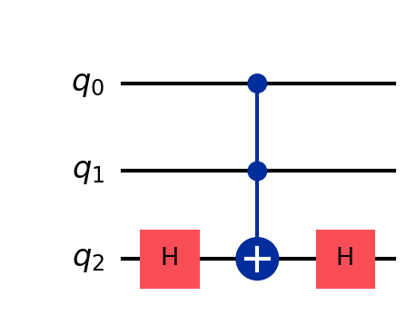

</div>

We get the following circuit after initializing the 3 qubits of the system, combined the circuit of the oracle with the amplification phase using `GroverOperator` and finally composed both circuits (the initialization and the oracle/amplification):

<div style="text-align: center;">

  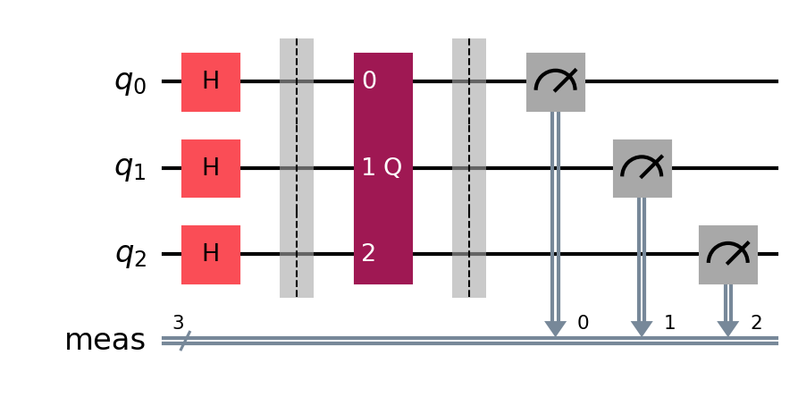

  The center part, once decomposed:
  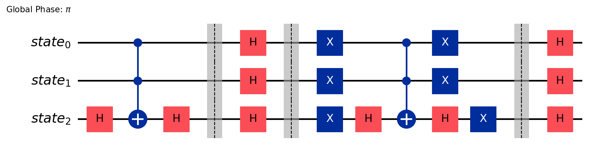

</div>

The oracle from the subject put a stamp on the state `111`, some results we can obtain:

| Results with a simulator | Results with quantum hardware |
| :-------------: | :-------------: |
| 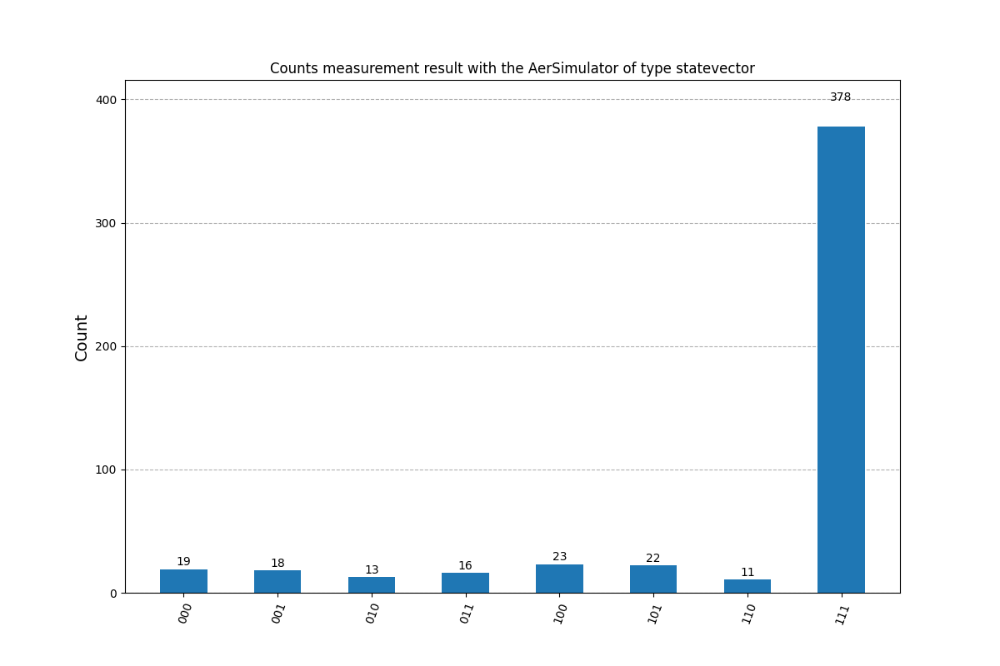 | 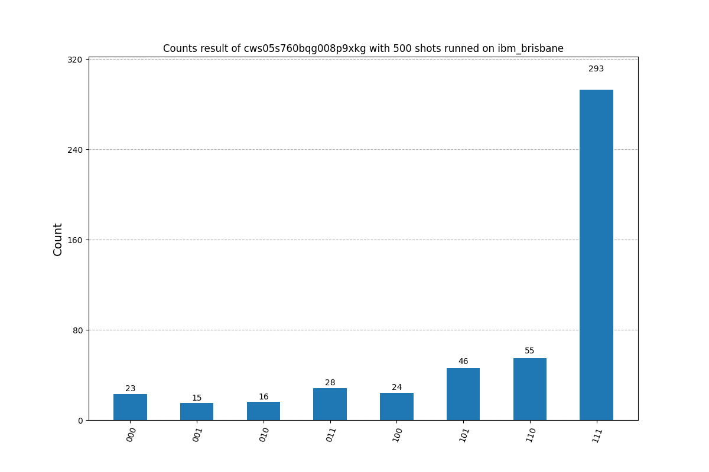 |
| 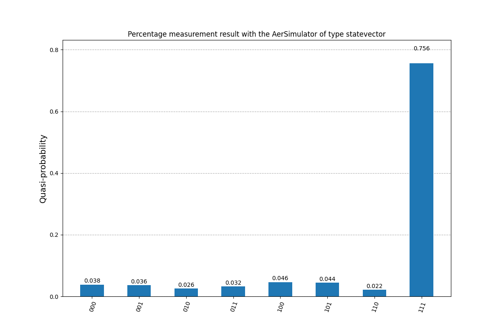 | 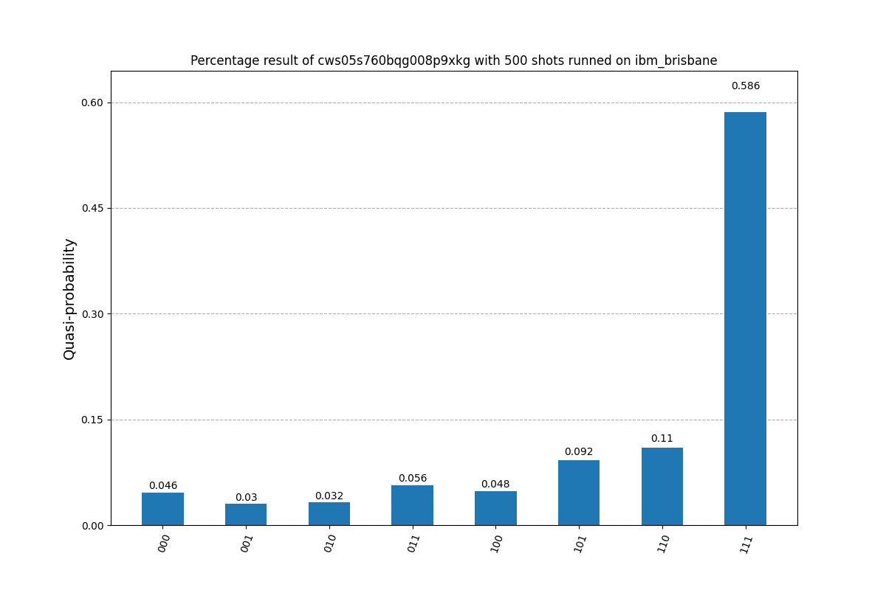 |

An Oracle tagging two states as answers for a circuit with 3 Qubits:
```python
  oracle = QuantumCircuit(3)

  oracle.x(2)

  qc.compose(MCMT(ZGate(), 2, 1), inplace=True)

  oracle.x([0, 1, 2])

  oracle.compose(MCMT(ZGate(), 2, 1), inplace=True)

  oracle.x([0, 1])

  oracle.draw(output="mpl", filename="oracle_two_solution")
```
Using this circuit, we can easily adjust some gates, the `compose` part to see the relation between those and the states created.

<details>
  <summary>Sources</summary>

  [Grover's Algorithm | Wikipedia](https://en.wikipedia.org/wiki/Grover%27s_algorithm)

  [L'informatique quantique c'est simple en fait - V2F (French) | Youtube](https://www.youtube.com/watch?v=wfXs7QXy4IU)

  [A Visual Introduction to Grover's Algorithm and Reflections - Gordon Ma | Youtube](https://www.youtube.com/watch?v=c30KrWjHaw4)

  [Grover's Algorithm | Qiskit Textbook](https://github.com/Qiskit/textbook/blob/main/notebooks/ch-algorithms/grover.ipynb)

  [Grover's Algorithm | IBM Quantum Learning](https://learning.quantum.ibm.com/tutorial/grovers-algorithm)

  [GroverOperator | IBM Quantum Documentation](https://docs.quantum.ibm.com/api/qiskit/qiskit.circuit.library.GroverOperator)

  [Grover's Algorithm - Qiskit Tutorials](https://github.com/Qiskit/qiskit-tutorials/blob/master/tutorials/algorithms/06_grover.ipynb) -> use of `Grover` deprecated class, so not really useful

  [Grover's Quantum Search Algorithm, Geometric Visualization, Quantum Circuit Diagram - Elucydia | Youtube](https://www.youtube.com/watch?v=en9qMDo-CDY)
</details>

# Documentation

## List given in the subject
[Julien Bobroff’s conference at USI on quantum levitation (in French) - Youtube](https://www.youtube.com/watch?v=6kg2yV_3B1Q)

[David Louapre Physique Quantique (in French) - Youtube](https://www.youtube.com/results?search_query=david+louapre+physique+quantique)

Useful videos (There is more to explore here) of [David Louapre (in French) - ScienceEtonnante](https://www.youtube.com/@ScienceEtonnante)

  - [Quantum mechanics in 7 ideas - Youtube](https://www.youtube.com/watch?v=Rj3jTw2DxXQ&pp=ygUlZGF2aWQgbG91YXByZSBwcm9ncmFtbWF0aW9uIHF1YW50aXF1ZQ==)

  - [La mécanique quantique [Vidéo]](https://scienceetonnante.com/2015/10/02/la-mecanique-quantique-video/)

  - [Les Ordinateurs Quantiques - Youtube](https://www.youtube.com/watch?v=bayTbt_8aNc)

  - [L'intrication quantique - Youtube](https://www.youtube.com/watch?v=5R6k2mEacZo)

  - [Les inégalités de BELL & les expériences d'Alain ASPECT - Youtube](https://www.youtube.com/watch?v=28UN70790Do)

  - [Les inégalités de Bell et les expériences d’Alain Aspect](https://scienceetonnante.com/2020/10/23/bell-aspect/)

  - [Alain Aspect : Intrication quantique et inégalités de Bell [Interview complète] - Youtube](https://www.youtube.com/watch?v=OeZ_63iKPho)

[A brief history of time: from the big bang to black holes - Stephen W. Hawking  - Anna's Archive](https://annas-archive.org/md5/b2cc885957410ba85d801a48e8ad9d3b)

[The Universe in your hand - Christophe Galfard - Archive.org](https://archive.org/details/universeinyourha0000galf_w4p7)

## Divers

[L'informatique quantique, c'est simple, en fait. - V2F | Youtube](https://www.youtube.com/watch?v=wfXs7QXy4IU)

[Understanding Superposition Physically and Mathematically in Classical and Quantum Physics](https://www.physicsforums.com/insights/understanding-superposition/)

[LinuxFoundationX: Introduction to Quantum Circuits](https://www.edx.org/learn/quantum-computing/the-linux-foundation-introduction-to-quantum-circuits?webview=false&campaign=Introduction+to+Quantum+Circuits&source=edx&product_category=course&placement_url=https://www.edx.org/school/linuxfoundationx)

[What is Quantum Computing? | IBM](https://www.ibm.com/topics/quantum-computing)

[Quantum Computing Stack Exchange](https://quantumcomputing.stackexchange.com/)

[FLP Vol. III Table of Contents](https://www.feynmanlectures.caltech.edu/III_toc.html)

[Photons Jumeaux | Youtube Channel](https://www.youtube.com/@photonsjumeaux4395/videos)

[Qiskit | Slack](https://qiskit.enterprise.slack.com)

[Qiskit | Youtube](https://www.youtube.com/@qiskit)

[IBM Quantum Documentation](https://docs.quantum.ibm.com/)

[Qiskit | IBM Quantum Computing](https://www.ibm.com/quantum/qiskit)

[qiskit | IBM Quantum Documentation](https://docs.quantum.ibm.com/api/qiskit)

[qiskit-community-tutorials | github](https://github.com/qiskit-community/qiskit-community-tutorials)

[Basics of Quantum Information | IBM Quantum Learning](https://learning.quantum.ibm.com/course/basics-of-quantum-information)

[Fundamentals of Quantum Algorithms | IBM Quantum Learning](https://learning.quantum.ibm.com/course/fundamentals-of-quantum-algorithms)

[The Map of Quantum Computing - Quantum Computing Explained](https://www.youtube.com/watch?v=-UlxHPIEVqA) ->  https://www.flickr.com/photos/95869671@N08/51721957923/

[Who Has The Best Quantum Computer? - Domain of Science | Youtube](https://www.youtube.com/watch?v=gcbMKt079l8)

[Quantum Computing - Domain of Science | Youtube](https://www.youtube.com/watch?v=VyX8E4KUkWw)

[Understanding Quantum Mechanics - Sabine Hossenfelder | Youtube Playlist](https://www.youtube.com/playlist?list=PLwgQsqtH9H5djIfFhXE6We207beTgUnyL)

[Introduction to Quantum Computing and Quantum Hardware - Qiskit | Youtube Playlist](https://www.youtube.com/playlist?list=PLOFEBzvs-VvrXTMy5Y2IqmSaUjfnhvBHR)
