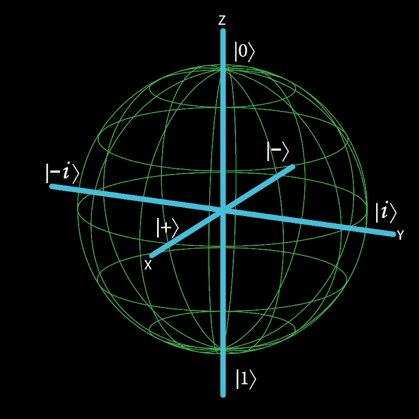
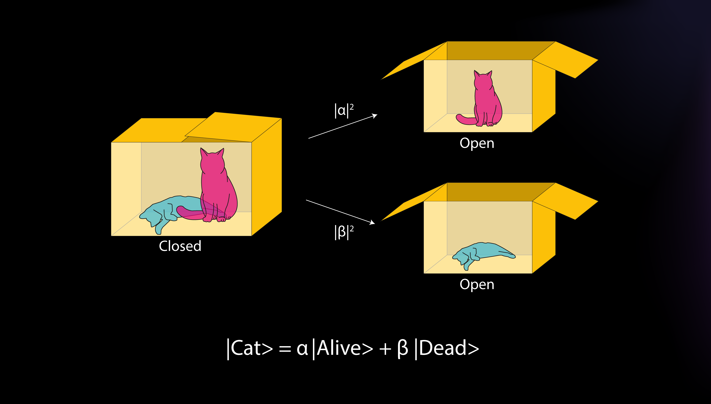
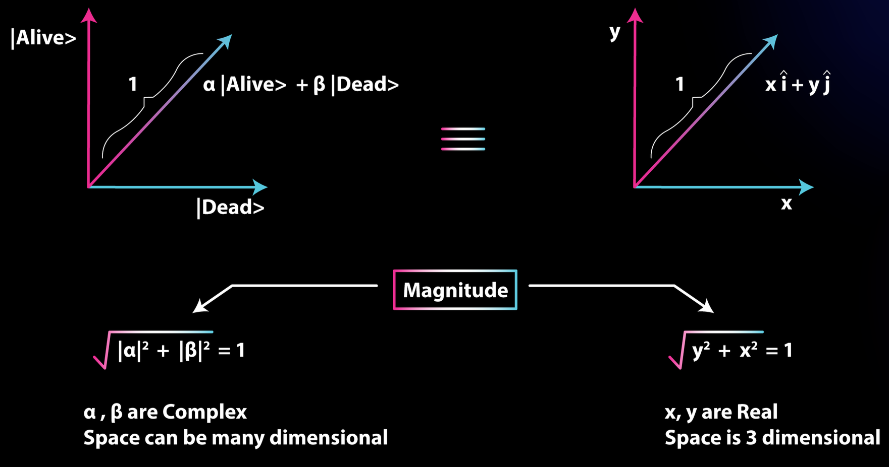

<h1>Documentation Générale</h1>

Ce fichier contient une partie de mes notes (non organisées et en français) sur différentes notions du projet (Qiskit, quantique ...).

<style>
  #h2 {
    background-color: violet;
    text-decoration-line: underline;
  }

  #h3 {
    background-color: yellow;
    text-decoration-line: underline;
  }

  #h4 {
    background-color: blue;
    text-decoration-line: underline;
  }
</style>

<h2>Qiskit</h2>

`assemble()`: Assemble une liste de circuits (`QuantumCircuit`) ou de schedule en un `Qobj` qui peut être run sur un backend.

`transpile()`: Transpile le circuit passé en paramètre suivant le backend sélectionné ou d’autres instructions pour la transpilation voulue.

- Ici, la transpilation est une sorte de compilation, c’est un processus qui va modifier le circuit passé en input pour qu’il puisse être compatible à l’outil quantique (simulateur ou ordinateur quantique réel) où il sera exécuté et optimiser le circuit pour cette exécution sur des systèmes quantiques ayant du bruit.

- Comme les ordinateurs quantiques physiques n’ont pas les mêmes configurations, composants, ne supportent pas forcèment les mêmes gates ou comportements, ont des limites physiques ≠ et utilisent des technologies ≠, cette étape d’adaptation est nécessaire pour faire en sorte que le circuit puisse être exécuter sur le backend spécifié.

- Paramètres:

  - `circuit`: le circuit à transpiler
  - `backend`: le backend sur lequel le circuit sera exécuté, i.e. `transpile()` va le rendre compatible avec l’appareil indiqué
  - `optimization_level`: un int spécifiant le niveau d’optimisation à appliquer. 0 étant pas d’opti et 3 une opti importante

https://docs.quantum.ibm.com/api/qiskit/compiler

https://docs.quantum.ibm.com/api/qiskit/transpiler

https://learning.quantum.ibm.com/tutorial/compare-transpiler-settings

<hr>

<h3>Instances</h3>

L’accès aux services de IBM Quantum sont contrôlés par les *instances* (anciennement *providers*) auxquels chaque utilisateur est assigné.

Une instance est composé de l’organisation suivante: *hub*, *group*, *project*. Un utilisateur peut appartenir à plusieurs instances.

Avec un plan/compte gratuit on est assigné automatiquement à l’instance `ibm-q/open/main` et c’est la seule disponible.

L’instance `ibm-q/open/main` donne accès à 4 QPC, tous les autres QPC ne peuvent absolument pas être manipulés (`QiskitBackendNotFoundError`).

On peut voir les instances auxquels on a accès dans notre [page de compte](https://quantum.ibm.com/account).

https://docs.quantum.ibm.com/guides/instances

<hr>

<h3>QuantumCircuit - class</h3>

<h4>`measure()`</h4>

`measure(qubit, cbit)`: Mesure un bit quantique (`*qubit*`) en une base Z vers un bit classique (`*cbit*`). Le premier paramètre est le qubit à mesurer, le second est le bit classique où placer le résultat de la mesure. Quand un état quantique est mesuré, un qubit est projeté sur la base *computational*, équivalent à une base canonique pour chaque qubit, (Pauli Z) à $\ket{0}$ ou $\ket{1}$. Le bit classique `*cbit*` indique le résultat de cette projection en un $0$ ou un $1$.

https://quantumcomputing.stackexchange.com/questions/1410/what-is-meant-by-the-term-computational-basis

$\color{#8cecb6}\rule{500px}{1.5px}$

<h4>`measure_all()`</h4>

`measure_all()`: ne prend pas d’argument et peut être appliquée à un circuit qui peut ne pas avoir de bits classique prédéfini. Elle va créer les fils classiques, stockés les résultats des mesures dans l’ordre et ajoutée une barrière avant la mesure.

<hr>

<h3>Result and visualization</h3>

https://docs.quantum.ibm.com/api/qiskit/visualization

<h4>`plot_histogram()`</h4>

render un histogramme d’une `list` ou un `dict`, provenant généralement de mesure d’un système.

https://docs.quantum.ibm.com/api/qiskit/qiskit.visualization.plot_histogram

$\color{#8cecb6}\rule{500px}{1.5px}$

<h4>`plot_state_city()`</h4>

render un état quantique en une image de building avec 2 set de barres de graphes pour les parties réelles et imaginaires de la matrice représentant l’état.

L’état du système doit être récupéré avant de faire une mesure du système, i.e. avant d’appeler `measure()` ou autre fonction du genre, logique puisque la mesure va faire collapse l’état des qubits donc on ne pourrait pas avoir les probas des états possibles.

Paramètres:

- `state`: l’état quantique de $N$ qubit, doit être un `Statevector` ou un `DensityMatrix` ou le retour de `save_statvector`
- `alpha`: valeur de transparence des barres

```python
# Les ≠ manières de récupèrer l'état quantique d'un QuantumCircuit *qc* (avant la mesure):
qc.save_statevector()
statevector = DensityMatrix(qc)
statevector = Statevector(qc)
```

https://docs.quantum.ibm.com/api/qiskit/qiskit.visualization.plot_state_city

https://quantumcomputing.stackexchange.com/questions/6731/the-meaning-of-the-city-plot-in-qiskit

$\color{#8cecb6}\rule{500px}{1.5px}$

<h4>`array_to_latex()`</h4>

```python
vector = array_to_latex(result.get_statevector(), source=True)
print(vector)
```

https://docs.quantum.ibm.com/api/qiskit/qiskit.visualization.array_to_latex

$\color{#8cecb6}\rule{500px}{1.5px}$

<h4>`QuantumCircuit.draw()`</h4>

Visualisation d’un `QuantumCircuit` via sa méthode `draw()`

https://docs.quantum.ibm.com/api/qiskit/qiskit.circuit.QuantumCircuit#qiskit.circuit.QuantumCircuit.draw

$\color{#8cecb6}\rule{500px}{1.5px}$

<h4>Visualisation du vecteur d’état (statevector) d’un circuit</h4>

Visualisation du vecteur d’état (statevector) d’un circuit, avant de placer les mesures, donc selon des probabilités idéales (e.g. 0.5 pour chaque état si deux possibilités).

`Statevector.from_instruction(qc)` retourne le vecteur d’état du `QuantumCircuit` *qc*

`probabilities_dict()` retourne sous forme de dict les probabilités de mesure du vecteur d’état

```python
ideal_distribution = Statevector.from_instruction(qc).probabilities_dict()
plot_histogram(ideal_distribution, title="Ideal distribution of this circuit", filename="ideal_dist")
```

<hr>

<h3>Primitives</h3>

*primitive unified bloc* (PUB)

*instruction set architecture* (ISA) **i.e., the set of instructions the device can understand and execute

https://medium.com/qiskit/what-are-qiskit-primitives-9bf63c1eacc7

https://docs.quantum.ibm.com/guides/get-started-with-primitives

https://docs.quantum.ibm.com/api/migration-guides/v2-primitives

https://docs.quantum.ibm.com/api/qiskit-ibm-runtime/qiskit_ibm_runtime.SamplerV2

<hr>

<h3>Aer</h3>

Package s’intégrant à Qiskit offrant des simulateurs d’ordinateurs quantiques avec des modèles de bruits réalistes.

- `save_statevector()`: permet de save l’état actuel d’un système en un vecteur d’état qui pourra être utilisé pour `plot_state_city()` en input.

    ajoute une espèce de barrière sur le circuit

$\color{#8cecb6}\rule{500px}{1.5px}$

<h4>AerSimulator - class</h4>

Noisy quantum circuit simulator backend.

- `method`: la méthode de simulation / le type de simulateur à utiliser.
    - `automatic`: par défaut, choisie la méthode de simulation selon le circuit et le modèle de bruit, `statevector`, `density_matrix`, `stabilizer`, `extended_stabilizer`, `matrix_product_state`, `unitary`, `superop`, `tensor_network`

Au lieu de passer par l’attribut `method` certaines options ont leurs classes de simulateurs avec des propriétés en plus:

- `QasmSimulator`: Noisy quantum circuit simulator backend. Nécessite une mesure sur le système. La data retournée est un dict facilement visualisable via `plot_histogram()`

     https://qiskit.github.io/qiskit-aer/stubs/qiskit_aer.QasmSimulator.html

- `StatevectorSimulator`: Ideal quantum circuit statevector simulator, supports CPU and GPU simulation methods. La data retournée est sous la forme d’un `StateVector` (https://docs.quantum.ibm.com/api/qiskit/qiskit.quantum_info.Statevector#)

     https://qiskit.github.io/qiskit-aer/stubs/qiskit_aer.StatevectorSimulator.html

- `UnitarySimulator`: Ideal quantum circuit unitary simulator, supports CPU and GPU simulation methods. La data retournée est sous la forme d’un `Operator`(https://docs.quantum.ibm.com/api/qiskit/qiskit.quantum_info.Operator)

     https://qiskit.github.io/qiskit-aer/stubs/qiskit_aer.UnitarySimulator.html


https://qiskit.github.io/qiskit-aer/stubs/qiskit_aer.AerSimulator.html

https://qiskit.github.io/qiskit-aer/tutorials/1_aersimulator.html#Simulation-Method

https://quantumcomputing.stackexchange.com/questions/27221/what-are-the-differences-in-using-qasm-statevector-and-unitary-simulators-in-q

<h2>Quantique</h2>

<h3>qubit | q-bit</h3>

Un *qubit* est l’unité équivalente au *bit* en programmation quantique, i.e. l’unité de base pour stocker de l’information.

Quand un système quantique est dans une superposition de deux états, c’est un *qubit*, pour un système avec une superposition de trois états, c’est un *qutrit*, pour un système quantique avec $d$ états (d étant un entier positif) c’est un *qudit*. Pour le moment, travailler avec et sur les *qubit* est suffisant pour la pq là où les *qutrit* et les *qudit* sont encore compliqués à obtenir et implémenter.

Là où un *bit* peut valoir 0 ou 1, un *qubit* peut être en plusieurs états à la fois, représentés par la combinaison linéaire des états $\ket{0}$ et $\ket{1}$ (e.g. 10% de 0 et 90% de 1), c’est la **superposition**.

Un *qubit* peut ainsi contenir 2 informations, deux qubit = 4 informations, trois qubit = 8 informations (2, 4, 8, 16, 32, 64). Un nombre de qubits $*N*$ peut contenir $2^N$ informations. Alors qu’un *bit* contient 1 information, deux bits = 2 informations … un nombre de bits $*N*$ peut contenir $*N*$ informations.

$\color{#8cecb6}\rule{500px}{1.5px}$

Les *qubits* peuvent être créés via ≠ méthodes/modalités pour former des *qubits* de ≠ sortes (leurs fonctionnements sera le même):

- ≠ types de qubits / méthodes de créations
    1. Superconducting qubits

        Les qubits formés via des supraconducteurs se base sur des propriétés quantiques de petites boucles de fil supraconducteurs.

        Un bloc basique pour formé un qubit supraconducteur est une jonction Josephon, qui est constitué de deux matériaux supraconducteurs, séparés par une couche faite d’un matériau isolant ou métallique non-supraconducteur et où l’on peut faire passer un courant.

        [Introduction to Quantum Circuits Course | edX](https://learning.edx.org/course/course-v1:LinuxFoundationX+LFQ103x+1T2023/block-v1:LinuxFoundationX+LFQ103x+1T2023+type@sequential+block@d0e6f2e0233a4271ac57b8fdf9e9f47b/block-v1:LinuxFoundationX+LFQ103x+1T2023+type@vertical+block@6331b03e286d4046a6113492b35f078a)

    2. Trapped ion qubits

        Le bloc de base d’un ordinateur quantique avec ce type de qubit sont des ions piégés et maintenu dans leurs positions grâce à des champs électromagnétiques, ceux-ci seront ainsi utilisés pour manipuler les états quantiques internes.

        Dans ce genre de système les qubits sont représentés par les états interne des ions, comme leurs spins nucléaires ou électroniques. Ces états sont manipulés en pointant des rayons lasers sur les ions, provoquant des transitions entre les ≠ niveaux d’énergies.

        Un des avantages de la méthode des ions piégés est que ces ions ont un temps de cohérence long, permettant de maintenir leurs états quantiques pour des périodes de temps relativement longue. Ainsi, cette modalité est souvent utilisée pour des types particuliers d’opérations en pq comme du quantum error correction (code quantique, équivalent des codes correcteurs).

        D’un autre côté, les ions doivent être refroidis à de très faibles températures et les pièges doivent être fabriqués et alignés de manière très précise. De plus, les ions sont sensibles à du bruit extérieur ou aux vibrations, ce qui peut affecter leurs états quantiques.

    3. Topological qubits
    4. Neutral atom qubits
    5. Spin qubits in semiconductors
    6. Photonic qubits

        Les photons sont la base d’un bloc de pq dans cette modalité. Les photons sont des particules de lumières qui peuvent être manipulés via les éléments optiques linéaires comme des beams splitters, detectors, phase shifters ou des rayons lasers.

        Les qubits sont représentés par la polarisation, les phases ou la fréquence de photons uniques.

        Un des avantages de cette méthode est que les photons sont transmissibles sur des longues distances via la fibre optique, cela les rend très adaptés pour de la pq distribué ou la communication quantique. De même, on peut manipuler les photons très rapidement et pour des coûts en énergie minime et cette méthode offre une capacité de scale le nombre de qubits dans le système la rendant prometteuse pour de la pq à grande échelle.

        Cependant, des photons peuvent être perdus et dispersés lors de transmission, ce qui affecte la qualité des états quantiques. La détection et manipulation de photons est aussi un autre défi qui nécessite une haute précision et exactitude.

    7. Molecular qubits
    8. NV-center qubits

Une des difficultés pour les scientifiques est de maintenir des qubits dans un état utilisable assez longtemps pour exécuter un programme. Par exemple les qubits dont les modalités impliquent des supraconducteurs ou la méthode des ions piégés nécessite d’être maintenu à une température proche du 0 absolu (-273,14 °C ou 0 K).

$\color{#8cecb6}\rule{500px}{1.5px}$

Un qubit est une superposition de deux états, cela peut être exprimé comme une combinaison linéaire des états de bases $\ket{0}$ et $\ket{1}$.

La difficulté est maintenant de visualiser ces états quantiques d’une manière abstraite, comme pour des vecteurs dans un espace vectoriel.

La sphère de Bloch est une représentation géométrique d'un état pur d'un système quantique à deux niveaux, i.e. un qubit. Ces états de qubit sont représentés comme des rayons partant de l’origine et finissant à la surface de la sphère.

Cette sphère prend une représentation vectorielle complexe des états d’un qubit ($\ket{\psi}=\alpha\ket{0} + \beta\ket{1}$) et le place dans la sphère pour qu’il pointe à la surface d’une représentation 3D de la sphère.

La sphère de Bloch avec les états $\ket{0}$ et $\ket{1}$ d’un qubit: https://prod-files-secure.s3.us-west-2.amazonaws.com/0483d3e2-6ccd-4c0f-abd4-f96df8bc9442/81b2fd87-47cb-4b75-80df-36686a82f912/Untitled.png

L’état $\ket{0}$ d’un qubit est un vecteur unitaire partant du centre de la sphère et se dirigeant vers la pole Nord de la sphère.

L’état $\ket{1}$ d’un qubit est un vecteur unitaire partant du centre de la sphère et se dirigeant vers le pole Sud de la sphère.

La sphère de Bloch a un radius de 1 et suivant les conventions de physique standard, l’axe x sort de la page, l’axe y pointe vers le côté et l’axe z est orienté verticalement.

Pour des points (x, y, z), $\ket{0}$ correspond au point (0, 0, 1) et $\ket{1}$ au point (0, 0, -1)

<hr>

<h3>notation bra-ket / Dirak notation </h3>

Le monde quantique fonctionnant différemment du monde classique, une nouvelle notation mathématique est nécessaire pour représenter des objets dans la mécanique quantique.

La notation bra-ket est la notation standard en mécanique quantique pour représenter des états quantiques et les divers opérations ou manipulations possibles sur ces états. On a la partie *bra*: $\bra{}$ et la partie *ket*: $\ket{}$.

On représente l’état d’un système par un vecteur, celui-ci contient la probabilité d’une quantité physique lié au système, généralement représenté par une expression mathématique.

exemple avec le chat de Schrödinger:

  Le chat à deux états quantiques: “vivant” **ou** “mort”. L’état du chat avant d’ouvrir la boite est donc: $\ket{Chat} = α\ket{Vivant} + β\ket{Mort}$ où ***α*** et ***β*** sont des nombres complexes.

Ce statement est appelé de divers façons: une wave-fonction (fonction d’onde), un état quantique, un vecteur état, **ket** …

Les nombres complexes sont des amplitudes de probabilités, elles contiennent les probabilités de sortie d’un état précis lorsque la mesure sera prise, dans le cas du chat: lors de l’ouverture de la boite.

La valeur absolue de ces nombres complexes est *toujours* inférieur à 1.

Comme ce sont des probabilités, la somme totale du carré de chaque nombre doit être égale à 1, cette constante est dite de “normalisation”: $|α^2| + |β^2| = 1$ et cela pour *N* états possibles.

La probabilité de trouver le chat vivant est de $|α|^2$ et la probabilité de trouver le chat mort est de $|β|^2$.

Si $α = \frac{1}{\sqrt{2}}$ et $β = \frac{1}{\sqrt{2}}$
Cela donne l’état suivant: $\ket{Chat} = \frac{1}{\sqrt{2}}\ket{Vivant} + \frac{1}{\sqrt{2}}\ket{Mort}$ et les probas seront $|α|^2 = \frac{1}{\sqrt{2^{ }}}^{2} = \frac{1}{2}$ et $|β|^2 = \frac{1}{\sqrt{2^{ }}}^{2} = \frac{1}{2}$, à partir de ces amplitudes, la proba de trouver le chat vivant ou mort de 50/50.

Lorsqu’on mesure un état, la wave-fonction “collapse” sur l’un des états possibles pour l’objet.

On a vu le *ket* en mécanique quantique, mais chaque *ket* à son *bra*. Cette idée vient du concept des vecteurs d’espaces.

Avec l’exemple du chat Schrödinger, là où *ket* est $\ket{Chat} = α\ket{Vivant} + β\ket{Mort}$ son *bra* est $\bra{Chat} = α^*\bra{Mort} + β^*\bra{Vivant}$. Ici $α^*$ et $β^*$ sont des complex conjugates (conjugué) des amplitudes, la constante de normalisation est toujours appliquée.

La structure mathématique $\ket{}\ket{}$ de deux *kets* (ou deux *bra* $\bra{}\bra{}$) est appelé ‘produit tensoriel’ ou ‘produit de Kronecker’. Cela peut aussi être écrit de la manière suivant: $\ket{}\otimes\ket{}$.

Le *ket* contient généralement un vecteur de colonne, le *bra* un vecteur de ligne.

<hr>

<h3>superposition</h3>

En physique “classique”, il existe la superposition des vagues. Lorsque plusieurs vagues se superposent dans l’espace et le temps, la vague résultante est la somme de l’amplitude individuelle des vagues à chaque point dans l’espace et le temps. Ce principe s’applique à ≠ types de vagues: électromagnétiques (la lumière), sonore, d’eau. Une application de ce type de superposition est trouvé dans la technologie de réduction de bruit d’écouteurs.

En mécanique quantique, la superposition est une propriété de système quantiques (comme des particules) leurs permettant d’exister en plusieurs états simultanément. Ce principe implique qu’un système quantique peut exister dans une combinaison linéaire de tous ces possibles états jusqu’à ce que le système soit observé ou mesuré. e.g. le chat de Schrödinger est à la fois vivant et mort jusqu’à ce que l’on ouvre la boite.

Dans les deux cas, la notion importante derrière la superposition c’est que l’effet combiné des plusieurs entités similaires à des vagues n’est pas simplement la somme de leurs effets pris individuellement. Les vagues interagissent entre elles d’une certaine façon ce qui provoque des patterns d’interférences, de l’amplification ou l’annulation de certaines caractéristiques.

Mathématiquement, la superposition est obtenu quand un système peut être décrit par une forme abstraite de plusieurs vecteurs, i.e. la combinaison linéaire de deux vecteurs. e.g. une corde à qui on donne un mouvement à chaque bout va avoir une vague W1 et une autre W2 donnant une vague/système W3, celle-ci peut être décrite comme une addition abstraite des vecteurs des vagues W1 et W2. On le dit ‘abstrait’ parce que les vecteurs pour W1 et W2 peuvent être n’importe quel vecteur parmi l’espace vectoriel de ce système.

Les états quantiques sont aussi appelés ‘wave functions’ comme ils subissent de l’interférence.

Il existe ≠ techniques pour appliquer la superposition dans un ordinateur destiné à être quantique, i.e. créer un qubit.

<hr>

<h3>états communs</h3>

Il existe des états de superpositions communs qui sont souvent utilisés dans la pq. Il en existe 4 et ont été nommés: *plus*, *minus*, *plus i* et *minus i*.

| plus | $\ket{+} = \frac{1}{\sqrt{2}}(\ket{0}+\ket{1})$ | Cet état est une superposition égale de $\ket{0}$ et $\ket{1}$. Les coeffs $\alpha$ et $\beta$ ont les deux pour valeurs $\frac{1}{\sqrt{2}}$.
Ces coordonnées (x, y, z) sur la sphère de Bloch sont (1, 0, 0). |
| --- | --- | --- |
| minus | $\ket{-} = \frac{1}{\sqrt{2}}(\ket{0}-\ket{1})$ | Cet état est aussi une superposition égale de $\ket{0}$ et $\ket{1}$ et est obtenu en changeant la phase relative entre ces deux états, i.e. en utilisant le signe `-` .
Ces coordonnées (x, y, z) sur la sphère de Bloch sont (-1, 0, 0). |
| plus i | $\ket{i} = \frac{1}{\sqrt{2}}(\ket{0}+i\ket{1})$ | Cet état est aussi une superposition égale de $\ket{0}$ et $\ket{1}$ et est obtenu en changeant la phase relative entre ces deux états, cette phase relative: $i = \sqrt{-1}$ sur l’axe y.
Ces coordonnées (x, y, z) sur la sphère de Bloch sont (0, 1, 0). |
| minus i | $\ket{-i} = \frac{1}{\sqrt{2}}(\ket{0}-i\ket{1})$ | Cet état est aussi une superposition égale de $\ket{0}$ et $\ket{1}$ et est obtenu en changeant la phase relative entre ces deux états, cette phase relative: $i = -\sqrt{-1}$ sur l’axe y.
Ces coordonnées (x, y, z) sur la sphère de Bloch sont (0, -1, 0). |

La sphère de Bloch avec ces états commun et les états $\ket{0}$ et $\ket{1}$:



Avec la sphère de Bloch on obtient les coordonnées sphériques, pour les coordonnées cartésiennes (x, y, z), avec un peu de géométrie, ces dernières coordonnées sont liées aux coordonnées sphériques ou au paramètres $\theta$ et $\phi$ et sont données par les relations suivantes:

$x=sin(\theta)cos(\phi)$

$y=sin(\theta)sin(\phi)$

$z=cos(\theta)$

Pour plus d’informations sur comment représenter un qubit dans une sphère de Bloch:

https://en.wikipedia.org/wiki/Bloch_sphere

https://learning.edx.org/course/course-v1:LinuxFoundationX+LFQ103x+1T2023/block-v1:LinuxFoundationX+LFQ103x+1T2023+type@sequential+block@80bf3847010a40b8a2e9d5488a1207d7/block-v1:LinuxFoundationX+LFQ103x+1T2023+type@vertical+block@1a17375f38004e70b8ec138890f4a0e6

<hr>

<h3>intrication quantique - entanglement</h3>

Il existe deux types d’états quantiques dans des systèmes composites: separable ou entangled.

<h4>separable</h4>

Un état séparable est un état quantique appartenant à un système composite qui peut être factorisé en des états individuels appartenant aux systèmes quantiques séparés.

Par exemple:

avec l’état d’un système bipartie: $\ket{\psi}=\alpha\ket{0}\ket{0} + \beta\ket{0}\ket{1} + \gamma\ket{1}\ket{0}+\delta\ket{1}\ket{1}$

si cet état peut être factorisé pour arriver au résultat suivant: $\ket{\psi}=\ket{\psi_1}\ket{\psi_2}$ avec $\ket{\psi_1}$ un état appartenant au premier système quantique et $\ket{\psi_2}$ au deuxième.

Avec des valeurs: $\ket{\psi}=\alpha\ket{0}\ket{0} + \beta\ket{0}\ket{1}$ où l’on considère que $\gamma=\delta=0$

on le factorise de la manière suivante: $\ket{\psi}=\ket{0}\otimes(\alpha\ket{0}+\beta\ket{1}) = \ket{\psi_1}\ket{\psi_2}$ où $\ket{\psi_1}=0$ appartient au premier système quantique et $\ket{\psi_2}=\alpha\ket{0}+\beta\ket{1}$ appartient au second système.

Cela s’applique aussi pour des systèmes *triparties* ou *multipartites*, i.e. pour un état séparé appartenant à l’un de ces systèmes: $\ket{\psi}=\ket{\psi_1}\ket{\psi_2}...\ket{\psi_n}$.

$\color{#8cecb6}\rule{500px}{1.5px}$

<h4>entangled</h4>

Quand ce n’est pas possible de factoriser un état quantique appartenant à un système composite, on a un état *entangled* (intriqué, enchevêtré).

$\ket{\psi}\ne\ket{\psi_1}\ket{\psi_2}...\ket{\psi_n}$ e.g. $\ket{\psi}=\frac{1}{\sqrt{3}}\ket{0}\ket{0}-\sqrt{\frac{2}{3}}\ket{1}\ket{1}$.

Déterminer si un état est séparable est actuellement possible pour des systèmes biparties mais il n’y a pas encore de moyens pour quantifier l’intrication dans des systèmes *triparties* ou *multipartites*.

Pour savoir si un état est *entangled*:

avec l’équation suivante: $\ket{\psi}=\alpha\ket{0}\ket{0}+\beta\ket{0}\ket{1}+\gamma\ket{1}\ket{0}+\delta\ket{1}\ket{1}$

si $\alpha\gamma=\beta\delta$ alors l’état est séparable, sinon il est entangled.

Deux qubits qui sont intriqués/entangled lorsqu’un est un mesuré, le résultat de la mesure de l’autre qubit dépend de la mesure du premier. Cette propriété est vérifiée même si une certaine distance sépare les deux qubits et que le temps entre les deux mesures est infime (la 2ème mesure est faite avant que n’importe quelle information ait eu le temps d’atteindre le second qubit, si une information était transmise, elle y irait plus vite que la vitesse de la lumière, ce qui est considéré comme impossible aujourd’hui). Voir l’expérience d’Alain Aspect, les inégalités de Bell.

<hr>

<h3>Bell states</h3>

Les états de Bell sont un groupe de 4 états quantique composés de deux qubits.

Ces états jouent un rôle important pour la téléportation quantique, l’intrication quantique et le codage superdense.

Les deux qubits formant un de ces états sont intriqués, et ce, de la manière maximale (corrélation maximale ou maximally entangled qubits). Toute mesure faite sur un sous-système sera liée à toutes les mesures possibles des autres sous-systèmes. Ce sont les états d’intrication qui violent le plus clairement les inégalités de Bell.

Pour reconnaître ce genre d’états il faut réaliser que l’état est symétrique malgré n’importe quelle permutation qu’on peut lui faire.

Les états de Bell suivant ≠ notations:

|  | notation avec le produit tensoriel | notation simplifiée | notation simplifiée factorisée |
| --- | --- | --- | --- |
| $\ket{\Phi^+}$ | $\frac{1}{\sqrt{2}}(\ket{0}_A\otimes\ket{0}_B+\ket{1}_A\otimes\ket{1}_B)$ | $\frac{(\ket{00}+\ket{11})}{\sqrt{2}}$ | $\frac{1}{\sqrt{2}}\ket{00}+\frac{1}{\sqrt{2}}\ket{11}$ |
| $\ket{\Phi^-}$ | $\frac{1}{\sqrt{2}}(\ket{0}_A\otimes\ket{0}_B-\ket{1}_A\otimes\ket{1}_B)$ | $\frac{(\ket{00}-\ket{11})}{\sqrt{2}}$ | $\frac{1}{\sqrt{2}}\ket{00}-\frac{1}{\sqrt{2}}\ket{11}$ |
| $\ket{\Psi^+}$ | $\frac{1}{\sqrt{2}}(\ket{0}_A\otimes\ket{1}_B+\ket{1}_A\otimes\ket{0}_B)$ | $\frac{(\ket{01}+\ket{10})}{\sqrt{2}}$ | $\frac{1}{\sqrt{2}}\ket{01}+\frac{1}{\sqrt{2}}\ket{10}$ |
| $\ket{\Psi^-}$ | $\frac{1}{\sqrt{2}}(\ket{0}_A\otimes\ket{1}_B-\ket{1}_A\otimes\ket{0}_B)$ | $\frac{(\ket{01}-\ket{10})}{\sqrt{2}}$ | $\frac{1}{\sqrt{2}}\ket{01}-\frac{1}{\sqrt{2}}\ket{10}$ |

La notation avec le produit tensoriel $\ket{0}_A \otimes \ket{0}_B$ peut être simplifiée en $\ket{00}$, pareil pour $\ket{1}_A \otimes \ket{1}_B$ avec $\ket{11}$.

Pour les états $\Phi$, si l’on mesure le qubit A, sa valeur sera $\ket{0}_A$ ou $\ket{1}_A$ avec une probabilité de 50% pour chaque et si le qubit B est mesuré, il sera dans le *même* état quantique avec une probabilité de 100%, d’où la corrélation maximale de ces états.

Pour les états $\Psi$, le qubit B, une fois mesuré sera dans l’état opposé à celui déjà mesuré avec une probabilité de 100%.

<hr>

<h3>Quantum Gates</h3>

<h4>gates</h4>

Dans un circuit quantique, une porte quantique est un circuit quantique élémentaire qui performe des opérations sur un petit nombre de qubits, changeant ainsi un état quantique vers un autre type.

Ces portes sont les composants de bases des circuits quantiques, comme c’est le cas des portes logiques classiques pour des circuits classiques.

Les portes quantiques les plus courantes fonctionnent sur des espaces d'un ou deux qubits.

Les portes quantiques sont **unitaires** et contrairement aux portes classiques sont **réversibles**. Ces deux capacités sont cruciales pour maintenir l’intégrité des informations quantique et permettre l’erreur de correction quantique.

Le concept d’unité réfère à la propriété d’une opération quantique de conserver la probabilité totale de l’état quantique sur lequel l’opération est faite.

Une opération quantique est unitaire si elle conserve le produit scalaire des vecteurs d’états sur lesquels l’opération est faite, conservant ainsi la norme de ces vecteurs d’états. Une opération unitaire conserve la probabilité qu’un état quantique soit mesuré dans cet état précis. Cet aspect assure que l’on introduit pas d’erreur dans le calcul.

La réversibilité est une propriété permettant d’annuler une opération quantique, faire marche arrière sur celle-ci. Dans un système classique d’ordinateur, les opérations sont irréversibles, une fois que l’opération est effectuée, l’état original du système est perdu et ne peut être restauré. Là où une opération unitaire dans un système de programmation quantique peut toujours être inversée en faisant l’opération inverse. L’unitarité assure la réversibilité.

Les opérations unitaires sont souvent utilisées pour créer et manipuler l’intrication entre des états quantiques, la réversibilité de ces opérations unitaires garantit la désintrication des états quantiques.

https://fr.wikipedia.org/wiki/Porte_quantique

https://learning.quantum.ibm.com/tutorial/explore-gates-and-circuits-with-the-quantum-composer#composer-operations-glossary

$\color{#8cecb6}\rule{500px}{1.5px}$

<h4>X gate</h4>

C’est la porte Pauli-X, aussi appelée bit-flip, elle agit sur un unique qubit.

Elle équivaut à une rotation de la sphère de Bloch autour de l'axe X par $\pi$ radians.

```python
     ┌───┐
q_0: ┤ X ├
     └───┘
```

| input | output |
| --- | --- |
| 0 | 1 |
| 1 | 0 |

représentée par la matrice de Pauli X:

$$
X = \begin{bmatrix}0 & 1\\1 & 0\end{bmatrix}
$$

https://docs.quantum.ibm.com/api/qiskit/qiskit.circuit.library.XGate

$\color{#8cecb6}\rule{500px}{1.5px}$

<h4>Control NOT / CXGate</h4>

Les portes contrôlées agissent sur plusieurs qubits où l’un agit comme un contrôle sur l’opération qui sera effectuée.

La porte Pauli-X contrôlée (CNOT, cX) agit sur 2 qubits. Elle effectue l’opération NOT sur le second qubit seulement lorsque le premier qubit est $\ket{1}$ et sinon le laisse tel quel.

Similaire à une porte XOR classique $’\ket{a, b}→\ket{a, a\otimes b}’$.

Le cercle rempli indique le qubit de contrôle et est connecté au qubit target via une droite verticale.

```python
# la gate dans l'autre sens: q_1 contrôle q_0
     ┌───┐
q_0: ┤ X ├
     └─┬─┘
q_1: ──■──
```

```python
# la gate dans l'autre sens: q_0 contrôle q_1
q_0: ──■──
     ┌─┴─┐
q_1: ┤ X ├
     └───┘
```

peut aussi être représenté de la manière suivante: https://fr.m.wikipedia.org/wiki/Fichier:CNOT_gate.svg comme c’est le cas dans les schémas du sujet

représentée par la matrice suivante:

$$
X = \begin{bmatrix}1 & 0 & 0 & 0\\0 & 1 & 0 & 0\\0 & 0 & 0 & 1\\0 & 0 & 0 & 1\end{bmatrix}
$$

dans ce sens la matrice est:

$$
X = \begin{bmatrix}1 & 0 & 0 & 0\\0 & 0 & 0 & 1\\0 & 0 & 1 & 0\\0 & 1 & 0 & 0\end{bmatrix}
$$

Input

| Control | Target |
| --- | --- |
| $\ket{0}$ | $\ket{0}$ |
| $\ket{0}$ | $\ket{1}$ |
| $\ket{1}$ | $\ket{0}$ |
| $\ket{1}$ | $\ket{1}$ |

Output

| Control | Target |
| --- | --- |
| $\ket{0}$ | $\ket{0}$ |
| $\ket{0}$ | $\ket{1}$ |
| $\ket{1}$ | $\ket{1}$ |
| $\ket{1}$ | $\ket{0}$ |

https://docs.quantum.ibm.com/api/qiskit/qiskit.circuit.library.CXGate

$\color{#8cecb6}\rule{500px}{1.5px}$

<h4>XOR</h4>

Symbolisé par $\oplus$.

| A | B | Output |
| --- | --- | --- |
| 0 | 0 | 0 |
| 0 | 1 | 1 |
| 1 | 0 | 1 |
| 1 | 1 | 0 |

https://docs.quantum.ibm.com/api/qiskit/qiskit.circuit.library.XOR

$\color{#8cecb6}\rule{500px}{1.5px}$

<h4>Hadamard gate</h4>

Cette porte est une rotation de pi autour des axes X+Y, cela à comme effet de changer la base de calcul (computation basis form) de $\ket{0},\ket{1}$ vers $\ket{+},\ket{-}$ et inversement.

```python
     ┌───┐
q_0: ┤ H ├
     └───┘
```

représentée par la matrice:

$$
H = \begin{pmatrix}\frac{1}{\sqrt{2}} & \frac{1}{\sqrt{2}}\\\frac{1}{\sqrt{2}} & -\frac{1}{\sqrt{2}}\end{pmatrix}
$$

L’effet d’une porte d’Hadamard sur les états de bases:

$$
H\ket{0} = \frac{1}{\sqrt{2}}\ket{0}+\frac{1}{\sqrt{2}}\ket{1}
$$

$$
H\ket{1} = \frac{1}{\sqrt{2}}\ket{0}-\frac{1}{\sqrt{2}}\ket{1}
$$

https://docs.quantum.ibm.com/api/qiskit/qiskit.circuit.library.HGate

<h3>quantum oracle</h3>

Un oracle quantique prend une string binaire $x$ en paramètre et sort en output une autre string binaire $f(x)$.

$x$ est appelé une query et $f(x)$ est une fonction d’oracle.

Quand l’oracle est queried, i.e. $x$ est passé en input de l’oracle, l’output sera $f(x)=0$ ou $f(x)=1$, $f$ est une fonction booléenne. La taille de de $(x)$ et de $f(x)$ peut être ≠ si la taille de $(x) > 1$.

Comme toutes transformations dans les ordinateurs quantiques sont unitaires, les oracles quantiques doivent également l’être. N’importe quel input donné à l’oracle doit avoir un output unique, cependant les oracles eux-mêmes ne sont pas forcément comme cela et deux questions peuvent avoir la même réponse.

Les oracles quantiques sont généralement notés comme une gate $O$.

Dans la plupart des problèmes, l’input à l’oracle est dans un état superposé.

$\color{#8cecb6}\rule{500px}{1.5px}$

<h2>mécanique quantique</h2>

La mécanique quantique est un ensemble de théories et de lois (dont on a pour le moment pas découvert de contradiction) qui sont appliqués aux unités physiques les plus petites de notre univers (à notre connaissance encore une fois) comme les atomes, les électrons, les particules subatomiques, les quarks, bosons …

L’un des principal principe de la mécanique quantique est celui de la **superposition**. Une propriété permettant à un objet (un atome, certaines molécules ou d’autres objets un peu plus gros e.g. un électron) d’être dans plusieurs états à la fois, i.e. les états se superposent. On peut avoir une infinité d’états superposés. e.g. un électron peut ainsi être à plusieurs endroits, avoir ≠ vitesses. Ces états doivent être *propres*, un état propre est un état pour lequel la valeur d’une propriété donnée (e.g. la vitesse) est parfaitement définie.

L’interprétation de Copenhague de la mécanique quantique est un ensemble de principes dont l’objectif est d’expliquer le comportement de particules subatomiques, l’interprétation statistique de Born des wave functions, appelé la loi de Born est une part importante de ceci. Ce courant de pensée à été développé par Bohr, Heisenberg, Jordan et Born.

Le débat Bohr-Einstein est une série de conversations et de correspondances entre ces deux scientifiques qui c’est déroulée entre 1920 et 1940. Le débat était centré sur la nature de la mécanique quantique et de l’interprétation des ces principes, avec Bohr défendant l’interprétation de Copenhague (qu’il a participé à créer) et Einstein qui plaide pour une vue plus déterministe.

<h3>postulats sur lesquels la mécanique quantique repose</h3>

1. Un vecteur normé $\psi>=\sum_{i=1}^{n}c_i\ket{u_i}$ contient des données sur l’état de systèmes de mécanique quantique.

    Le $n$ est appelé la dimension du système quantique.

    $\sum{}{}$ indique la ‘somme sur l’index $i$’.

    Le $c$ est un nombre complexe de tel façon que $|c_1|^2 + |c_2|^2 + … + |c_n|^2 = 1$, c’est la constante de normalisation.

    Les états $\ket{u_i}$ sont les états de bases, similaires aux vecteurs $\^{x}$, $\^{y}$, $\^{z}$ dans un espace vectoriel 3D.

    Quand $n=2$, l’état quantique est réduit à ce que l’on appelle un *qubit*.

2. Un observable est une quantité physique qui peut être mesuré.

    Dans le monde ‘classique’, on considère des observables physiques comme ce que l’on appelle des fonctions scalaires à valeurs réelles. e.g. l’énergie kinétique: $K.E. = \frac{1}{2}mv^2$

    Ce sont simplement des nombres réels.

    Les observables physiques (énergie, position, momentum, spin …) sont également nommés Opérateurs. C’est ≠ de la mécanique classique. e.g. $A$ qui agit sur *kets* ($\ket{\psi}$ pour produire d’autre *kets* ($\ket{\xi}$) ce qui donne l’équation $A\ket{\psi}=\ket{\xi}$

3. Tout observable noté $'\ket{a_i}'$ est associé à un eigenvalue (valeur propre) noté $'\ket{u_i}'$ ce qui donne l’équation $A\ket{u_i}=|a_i\ket{u_i}|$

    Les valeurs propres/eigenvalues sont des nombres réels. Le nombre d’eigenvalues dépend du nombre d’états possible où le système quantique peut être, ce qui est aussi appelé la dimension de l’espace noté précédemment par $n$.

4. En mécanique quantique, un système quantique est dans une superposition d’états de bases possibles (eigenvalues).

    Quand on fait une mesure du système, la superposition s’effondre et on trouve le système dans un état eigenvalue particulier. On peut seulement prédire la proba de trouver un ‘eigenstate’ particulier à la mesure.

    La proba de trouver un état quantique $'\ket{u_i}'$ au moment de la mesure faite sur un état superposé $'\ket{\psi}'$ avant la mesure est donné comme suit: $P(i)=|\bra{\psi}\ket{u_i}|=|^2c_i|^2$.

    Ce sera un nombre réel inférieur à 1 (c’est une proba).

    exemple avec l’état suivant: $\ket{\psi}=\frac{1}{\sqrt{2}}(\ket{0}+\ket{1})$, ici $c_1=\frac{1}{\sqrt{2}}$ et $c_2=\frac{1}{\sqrt{2}}$ et $\ket{u_2}=\ket{1}$

    cela donne: $P(i=1)=|c_1|^2=|\frac{1}{\sqrt{2}}|^2=\frac{1}{2}$

5. Les transformations faites sur des états quantiques doivent être unitaires. Des transformations unitaires sont comme des rotations de vecteurs.

    La raison de leurs utilisations est qu’elles permettent de préserver la constante de normalisation d’états quantiques, comme la rotation de vecteur qui préserve la longueur de celui-ci.

    La préservation de cette constante de normalisation est nécessaire car une transformation dans la mécanique quantique devrait prendre un état quantique vers un autre.

6. En mécanique quantique, quand il faut décrire deux ou plus de systèmes quantiques rassemblés, on les nomme des *systèmes composites*.

$\color{#8cecb6}\rule{500px}{1.5px}$

<h3>Schrödinger’s cat thought experiment</h3>

Si l’on suit les lois de la mécanique quantique de l’interprétation de Copenhague, le chat est mort “*et”* vivant au même moment jusqu’à ce que l’on ouvre la boite et que l’on mesure l’état du chat.

Dans un système classique, contrairement au monde quantique, on dit que le chat est mort “*ou”* vivant, avant même que l’on ouvre la boite.

C’est cette distinction principale entre classique et quantique qui est montré par la différence dans l’usage des mots: “*et”* et “*ou*”.

Cependant, une fois que l’on a ouvert la boite, on réalise une mesure et dans les cas classiques et quantiques on va trouver le chat mort ou vivant. C’est l’état *avant* la mesure qui fait la différence.



> [!WARNING]
> un certain nombres d’illustrations ou d’équations ont des petits problèmes (parenthèses manquantes, mauvaise sphère de Bloch pour un état …) sur le cours du site mais ils sont correct sur le pdf de ressources donné au début du cours.

ressources:

[Introduction to Quantum Circuits Linux Resources & Equations.pdf](https://prod-files-secure.s3.us-west-2.amazonaws.com/0483d3e2-6ccd-4c0f-abd4-f96df8bc9442/760fe007-dba6-4300-9001-4ab383de081c/Introduction_to_Quantum_Circuits_Linux_Resources__Equations.pdf)

$\color{#8cecb6}\rule{500px}{1.5px}$

<h3>vecteur</h3>

Les états quantiques peuvent être imaginés comme des vecteurs.

Les vecteurs utilisés en mécanique quantique diffèrent de ceux dont on a l’habitude puisque que les quantiques peuvent avoir des éléments complexes et que l’espace où ils se situent peut être à plus de 3 dimensions.

Dans le cas du chat de Schrödinger: $\ket{Vivant}$ et $\ket{Mort}$ jouent le rôle d’unité de vecteur pour l’état quantique du chat, comme $î$ et $ĵ$ dans la figure ci-dessous.

La magnitude d’état quantique est inférieur à 1, dans le cas où c’est purement un état quantique, alors la magnitude est égale à 1.

La mécanique quantique ne spécifie pas que l’espace-temps est multidimensionnel. L’espace où l’on dit que les états quantiques se situent est seulement pour des raisons mathématiques et de représentations, ce n’est pas un espace réel.



$\color{#8cecb6}\rule{500px}{1.5px}$

<h3>états de base</h3>

Les états de base d’un système quantique sont un set de states qui décrit tout les états possible du système. C’est possible d’utiliser des vecteurs pour illustrer ces états de base. Un vecteur bi-dimensionnel $\overrightarrow{α}$ peut être écrit comme suit: $\overrightarrow{α} = 2\^{i} + 2\^{j}$. Ici $\{{\^{i}, \^{j}}\}$ sont des vecteurs de bases qui se traduisent en états de bases avec la mécanique quantique. Il y a une infinité de vecteurs possible dans cet espace bi-dimensionnel, et chacun utilise les vecteurs de bases qui peuvent être décrit comme une combinaison linéaire. Une des propriétés des vecteurs de bases est que l’on peut générer n’importe quel vecteur grâce à leurs combinaison linéaire. Ainsi, n’importe quel état possible d’un système de mécanique quantique peut être générer grâce à la combinaison linéaire de leurs états de base.

Les états *ket* sont ainsi représentés en utilisant ce concept des vecteurs, e.g. $\{\ket{0}, \ket{1}\}$ (computational basis). Suivant le problème étudié on peut choisir les états de bases pour décrire le système. Le nombre de *kets* dans la base est égal aux dimensions du système, e.g. avec le chat de Schrödinger on a un système à deux états et on considère le set de deux *kets* $\{\ket{vivant}, \ket{mort}\}$ suivant comme états de base.

$\color{#f80779}\rule{180px}{1.5px}$

- Produit scalaire d’états (Inner products of states)

     https://learning.edx.org/course/course-v1:LinuxFoundationX+LFQ103x+1T2023/block-v1:LinuxFoundationX+LFQ103x+1T2023+type@sequential+block@2841d386156e4275b4eb719c0bdfb924/block-v1:LinuxFoundationX+LFQ103x+1T2023+type@vertical+block@c8c79f8d7ed04c9a9bb01e2ce95804f9

    https://learning.edx.org/course/course-v1:LinuxFoundationX+LFQ103x+1T2023/block-v1:LinuxFoundationX+LFQ103x+1T2023+type@sequential+block@2841d386156e4275b4eb719c0bdfb924/block-v1:LinuxFoundationX+LFQ103x+1T2023+type@vertical+block@2a7149bc5a0d4f7189e0975d06a3956a


Le produit scalaire est nécessaire pour trouver la distance entre deux vecteurs et la longueur de vecteurs. Quand un vecteur d’état est utilisé comme produit scalaire avec lui-même, il représente le carré de la distance du vector. De même, la distance de tous les états quantique dans un espace vectoriel quantique devrait être égal à 1, comme il représente une probabilité (cf la constante de normalisation).

Les opérateurs sont des transformations, appliqués à des vecteurs d’état-état quantique, qui prennent un état vers un autre état, tout comme une rotation est un opérateur qui transforme un vecteur vers un autre vecteur sans changer sa taille. e.g. l’opérateur de rotation $R$ peut ainsi rotaté le vecteur $\overrightarrow{a}$ dans un horaire ou anti-horaire selon l’angle $\theta$, cela donne $R_x(\theta)\overrightarrow{a} = \overrightarrow{b}$ si c’est fait sur l’axe des x. Les gates quantiques et les mesures peuvent être considérés comme des opérateurs.

$\color{#f80779}\rule{180px}{1.5px}$

- Produit extérieur d’états (Outer products of states)

    https://learning.edx.org/course/course-v1:LinuxFoundationX+LFQ103x+1T2023/block-v1:LinuxFoundationX+LFQ103x+1T2023+type@sequential+block@2841d386156e4275b4eb719c0bdfb924/block-v1:LinuxFoundationX+LFQ103x+1T2023+type@vertical+block@f06a01cf9aa24b2b87c762a100330e5a

$\color{#8cecb6}\rule{500px}{1.5px}$

<h3>mesure quantique</h3>

Une mesure quantique idéale est associée à un set d’opérateurs de projections, comme par exemple $P_m$ où $m$ est le résultat qui pourrait être obtenu après que $P_m$ est appliqué sur l’état quantique.

Le résultat de cette mesure peut être de deux sortes: le résultat est le même peut importe le nombre de fois où l’on répète la mesure (mesure projective ou mesure de von Neumann), ou les répétitions des mesures ne produisent pas le même résultat.

Admettons que l’état du système avant la mesure soit $\ket{\psi}$, la probabilité de trouver un résultat $m$ après la mesure sera: $p(m) = \bra{\psi}P_m\ket{\psi}$.

Le côté droit signifie juste que l’on transforme l’état vecteur $\ket{\psi}$ vers un autre vecteur $P_m\ket{\psi}$ puis prend le produit scalaire avec $\bra{\psi}$. Ainsi, contrairement au cas de mesure classique, le système quantique change son état après la mesure. Ce état est alors: $\ket{\psi} = \frac{P_m\ket{\psi}}{\sqrt{p(m)}}$ où $\sqrt{p(m)}$ est le facteur de normalisation.

$\color{#f80779}\rule{180px}{1.5px}$

Si on applique cela au système du chat de Schrödinger, l’état initial est: $\ket{\psi} = \alpha\ket{vivant} + \beta\ket{mort}$.

Les deux opérateurs de projections sont les suivants: $P_{vivant} = \ket{vivant}\bra{vivant}$ et $P_{mort} = \ket{mort}\bra{mort}$.

La probabilité pour que le chat soit vivant est alors:

$p(vivant) = \bra{\psi}P_{vivant}\ket{\psi}$

$p(vivant) = (\alpha\ket{vivant} + \beta\ket{mort})\ket{vivant}\bra{mort}.(\alpha\ket{vivant} + \beta\ket{mort})$

Signifiant que $p(vivant) = |\alpha|^2$.

Le nouvel état après la mesure: $\frac{P_{vivant}\ket{\psi}}{\sqrt{p(vivant)}} = \frac{\ket{vivant}\ket{vivant}.\ket{\psi}}{\sqrt{|\beta|^2}} =\ket{vivant}$

Pour avoir la probabilité que le chat soit mort: $p(mort) = \bra{\psi}P_{mort}\ket{\psi} = |\beta|^2$

et l’état après la mesure: $\frac{P_{mort}\ket{\psi}}{\sqrt{p(mort)}} = \frac{\ket{mort}\bra{mort}.\ket{\psi}}{\sqrt{|\beta|^2}} = \ket{mort}$

Avec ça, l’état initial qui était une superposition des deux états $\ket{vivant}$ et $\ket{mort}$ a *collapse* dans l’un ou l’autre de ces états après la mesure.

$\color{#8cecb6}\rule{500px}{1.5px}$

<h2>applications de la programmation quantique</h2>

Les ordinateurs quantiques utilisent la mécanique quantique et ses propriétés pour effectuer ses calculs. Ce fait rend ces ordinateurs extrêmement sensible au bruit (noise) extérieur.

La programmation quantique (pq) permet de résoudre *certains* problèmes/algorithmes plus rapidement, notamment ceux dont la durée de résolution croit exponentiellement (trié une liste, factorisé un nombre premier), elle offre une puissance de calcul plus élevée. Ce trait est appelé *quantum speedup*.

L’autre importante utilité est de pouvoir faire des simulations quantiques, pour faire des mathématiques quantiques. Ainsi on pourrait lui poser des problèmes d’optimisation pour trouver une molécule, un élément qui conviendrait le mieux, serait le plus efficace pour une situation donnée à la place d’essayer en laboratoire toute les combinaisons pour arriver à un résultat.

La programmation quantique serait également très efficace pour modéliser des molécules, leurs interactions ou pour la chimie quantique dans sa globalité.

Elle a aussi le potentiel de résoudre certains problèmes de types “boites noires” (black box), problème où le fonctionnement interne du système n’’est pas connu ou n’est pas accessible. Des problèmes typiques de black box sont l’optimisation globale (l’objectif étant de trouver la meilleure solution parmi une multitude de possibilités), le Machine Learning (pour entraîner des modèles sur de larges data set, mêmes dans les cas où la distribution sous-jacente des données n’est pas connus comme cela peut être le cas pour la reconnaissance d’image ou le Natural Language Processing) et la Cryptanalyse (la méthode de chiffrement n’est pas connue mais la clé oui, l’utilisation de pq casserais beaucoup de processus de chiffrement qui sont considérés comme sûrs).

Un des problèmes où la programmation quantique est attendue à briller c’est la factorisation des nombres premiers. Pas mal d’algorithmes de cryptographie (RSA) se base sur cette factorisation, or l’algorithme de Shor (un mentionné dans les bonus) permet de décomposer de manière *très* optimiser des nombres premiers de grande taille, là où un algorithme classique mettrait *beaucoup*, *beaucoup* plus de temps pour y arriver, c’est ce qui protège ces algos de cryptographie.

Un oracle ou boite noire est en programmation quantique une opération, non connue, qui est utilisée comme input pour un autre algorithme.

$\color{#8cecb6}\rule{500px}{1.5px}$

<h3>critères de DiVincenzo</h3>

Groupe de guidelines pour évaluer la commodité d’utilisation d’ordinateurs quantiques proposées en 2000 par David DiVincenzo.

1. Scalability: on peut ajouter des qubits au système sans avoir à augmenter grandement la complexité du hardware.

    Actuellement il faudrait des systèmes expérimentaux beaucoup plus grand pouvant fonctionner avec un grand nombre de qubits.

2. Initialization: la possibilité d’initialiser l’état de qubits dans le système impliqué d’un simple état de référence comme $\ket{0}$ ou $\ket{1}$ …

    C’est nécessaire pour que les qubits puissent être réutilisés pour des calculs divers.

3. Coherence time: les états dans le système devrait avoir des temps de décohérence élevées, largement plus que le temps nécessaire pour les opérations faites par les gates.

    Plus le temps de cohérence sera long, plus grande seront les probabilités que les états du système quantique seront en superposition, une ressource nécessaire pour la pq.

4. Gates: les gates sont les manipulations, sous la forme de méthodes, sur les qubits, i.e. les états quantiques du système.

    Ces méthodes devraient pouvoir effectuer toutes les opérations possibles en programmation quantique.

    e.g. dans des circuits quantiques fait avec des supraconducteurs, des impulsions micro-ondes effectuées sur les qubits supraconducteurs sont transformées en opérations faites par les gates.

5. Measurement: il doit y avoir une manière de mesurer l’état d’un qubit dans un système quantique. L’objectif est d’avoir accès à une méthode pour mesurer les états sans affecter le système, généralement via des mesures non-projectives.

$\color{#8cecb6}\rule{500px}{1.5px}$

<h3>Quantum Circuit</h3>

Un circuit quantique est l’élément principal de la programmation quantique.

Ce circuit est une routine de calcul constituée d’opérations quantiques cohérentes effectuées sur de la donnée quantique, e.g. des qubits.

Un programme quantique peut être représenté comme une séquence de circuits quantiques et de calcul classique near-time (délai entre l’occurrence d’un évènement et l’utilisation de la donnée produite).

Un des composants d’un circuit quantique est un registre quantique (quantum register), c’est une collection de qubits utilisés pour des calculs. Les quantum register sont indiqués avec le symbole ‘q’ là où les register classiques avec ‘c’. Dans les circuits ils sont représentés comme des fils (lignes droites) et les qubits sont mis en subscript du register, commençant par 0 puis incrémenter de 1 pour chaque nouveau circuit avec un qubit.

Dans les schémas représentant les circuits quantiques, le sens du circuit est de la gauche vers la droite, les gates sont appliquées dans le même sens.

Dans la plupart des textes, le qubit en haut du circuit est la partie la plus à gauche du *ket* et le qubit du bas est la partie la plus à droite. e.g. $\ket{q_0q_1q_2...}$

Avec Qiskit, le qubit du haut correspond à la partie droite du *ket* et le qubit du bas la partie gauche. e.g. $\ket{...q_2q_1q_0}$

<h2>divers</h2>

<h3>voc</h3>

*Ansatz*: supposition de la valeur ou de la forme d’une fonction inconnue et aide à dériver la solution réelle d’une équation. En programmation quantique c’est généralement un circuit paramétré souvent utilisé dans des “variational algorithms”, il est utilisé comme un point de départ ou “trial state” qui sera mis à jour itérativement suivant les données qui ont été calculées. https://www.youtube.com/watch?v=mJqVFJsXfis

*Bit-flip*: opération qui donne 0 pour 1 et 1 pour 0, également appelé l’opération knot ou X gate.  https://www.youtube.com/watch?v=QrK8D54iAdA

*probability wave*: A quantum state of a particle or system, as characterized by a wave propagating through space, in which the square of the magnitude of the wave at any given point corresponds to the probability of finding the particle at that point. Mathematically, a probability wave is described by the wave function, which is a solution to the wave equation describing the system.

$\color{#8cecb6}\rule{500px}{1.5px}$

<h3>principe d’incertitude d’Heisenberg</h3>

Ce principe énonce qu’il existe des configurations dans lesquelles, deux propriétés (e.g. la longueur d’onde et la position d’une onde) ne peuvent pas conjointement être aussi précisément mesurées comme on le souhaite. Pour en mesurer une précisément, l’autre doit être imprécise.

https://www.youtube.com/watch?v=HqyJ7-ibUmo

$\color{#8cecb6}\rule{500px}{1.5px}$

<h3>distinction des sciences</h3>

La mécanique quantique s’occupe d’examiner les propriétés de la matière à l’échelle microscopique, *quantum information science* se concentre sur l’extraction de données depuis ces propriétés et la programmation quantique sur la manipulation et le process de ces données.

$\color{#8cecb6}\rule{500px}{1.5px}$

<h3>Composite quantum systems</h3>

Un système quantique composite est formé d’une paire de système quantique qui possède un lien entre eux, l’un affectant l’autre même si les deux systèmes sont séparés physiquement.

Les états de bases d’un système composite de deux qubits sont: $\{\ket{0}\ket{0},\ket{0}\ket{1},\ket{1}\ket{0},\ket{1}\ket{1}\}$ au lieu de $\{\ket{0},\ket{1}\}$ pour les états de bases d’un qubit ‘normal’.

Ce type de système est aussi désigné sous l’appellation ‘systèmes bipartites’. Pour des systèmes composites ayant des systèmes quantiques avec trois qubits, le terme ‘système tripartie’ est utilisé. Si on généralise cette idée à plus de systèmes, le système devient ‘multipartie’.

[Course | edX](https://learning.edx.org/course/course-v1:LinuxFoundationX+LFQ103x+1T2023/block-v1:LinuxFoundationX+LFQ103x+1T2023+type@sequential+block@7d40ac3476a4468c8c4754223bf24533)

$\color{#8cecb6}\rule{500px}{1.5px}$

<h3>quantum parallelism</h3>

https://www.quera.com/glossary/parallelism

https://arxiv.org/html/2405.07222v1

$\color{#8cecb6}\rule{500px}{1.5px}$

<h3>quantum interference</h3>

L’interférence quantique c’est quand des particules subatomiques interagissent et s’influencent entre elles et d’autres particules alors qu’elles sont en un état probabiliste de superposition. Ce phénomène peut influencer la probabilité de sortie de l’état quantique lorsqu’il est mesuré.

Dans un système quantique, les particules existent sous la forme de [probability waves](https://www.notion.so/Quantique-m-canique-et-autres-da5c463aadd947eb8ed9ed7fbba2e814?pvs=21) de positions possibles. Ces *probability waves* peuvent interagir, d’une façon que quand le système est mesuré, certains résultats sont plus probables et d’autres moins. C’est le pattern d’interférence, quand les vagues se renforcent c’est l’interférence constructive, lorsqu’elles s’annulent c’est l’interférence destructive.

https://www.techtarget.com/whatis/definition/quantum-interference supprimer la classe `paywall` de la div où est l’article et le node `section class="sign-up-wrapper inline-reg page1 sc-smartforms-techtarget"`
